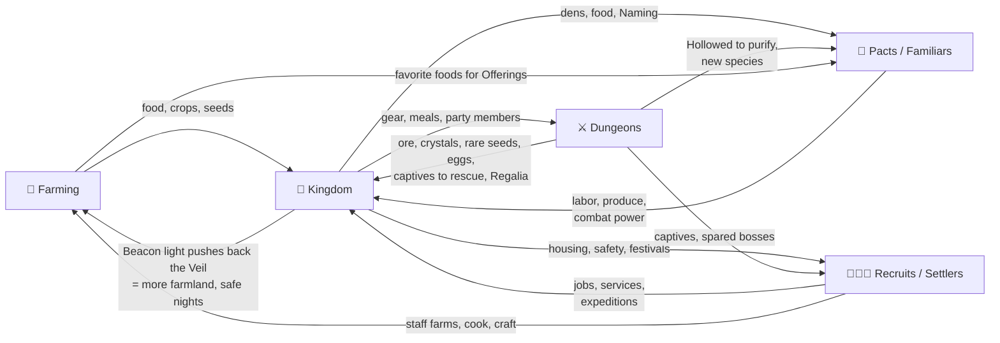

# 01 — Vision

> **TL;DR:** You were the greatest monarch who ever lived. You died, and you wake up a nobody in a mist-drowned wilderness with a talking ember for company. You survive the first nights, farm to feed yourself and later your people, dive into shifting dungeons, form pacts with mystical creatures, spare and recruit your enemies, and rebuild a kingdom from a single campfire.
> **In one line:** *Stardew Valley meets Suikoden, with pact-bound creatures, anime heart, and a fallen monarch's second chance.*

---

## 1. One-page pitch

| | |
|---|---|
| **Working title** | **TBD**: *Crownless* is already used by a game on Steam; shortlist in [Q-01](12_DECISIONS_AND_OPEN_QUESTIONS.md#part-b-open-questions-for-you). Codename **NOZE** |
| **Genre** | Farming life-sim × dungeon crawler × kingdom builder × creature pacts, with survival at the frontier |
| **Perspective** | Top-down 3/4 view, hand-drawn illustrated 2D with chibi-anime characters |
| **Platform** | PC (Steam) first; the web build is used for development and testing; consoles evaluated after 1.0 |
| **Language** | English (all text is key-based, ready for later localization, e.g. Bahasa Indonesia) |
| **Players** | Single-player |
| **Business model** | Premium, one-time purchase (target $19.99–$24.99), no microtransactions |
| **Target rating** | ESRB E10+ to T / PEGI 7–12 (fantasy violence, mild language, alcohol references) |
| **Session shape** | One in-game day ≈ 14 real minutes; natural "one more day" stopping points |
| **Length** | EA ~15–25 h; 1.0 main story ~60 h; completionist 120 h+ |

**Logline:**
> *Once a sovereign. Now an exile. Rebuild the kingdom you lost.*

---

## 2. The core fantasy

> **"From a lone exile at a dying campfire to a beloved sovereign of a thriving realm, built with your own hands, your people, and the creatures who chose to follow you."**

Three feelings, in order:

1. **Humility.** A legendary monarch reduced to picking berries and fearing the dark. (Survival)
2. **Growth.** Every field planted, every creature befriended, every person recruited makes the realm visibly bigger. (Farming + Building + Pacts)
3. **Sovereignty.** Holding court, issuing decrees, knighting heroes, deciding the fate of former enemies. (Kingdom + Story)

---

## 3. Design pillars

Every feature must serve at least one pillar. If it serves none, it gets cut.

### Pillar 1: Every Day Builds the Kingdom
Every action, whether a harvest, a dungeon dive, or a conversation, contributes to one visible goal: the realm. Progress should be **seen on the map**: the throne grows from ruin to palace, the Beacon's light pushes the mist back, the town's music gains instruments as it grows.
- ✅ Crops feed your people (Food Stock), not just your wallet.
- ✅ Dungeon loot unlocks buildings; recruits unlock services.
- ❌ No isolated minigames with no link to the realm.

### Pillar 2: A Crown Is Held Up by Many Hands
Power comes from **bonds**, not domination. Creatures join through *Pacts*: some through strength, many through kindness. Enemies can be **spared and redeemed**. The final battle is won by how many people you've earned, not by your personal level alone.
- ✅ Mercy is a real, rewarded choice.
- ✅ Every named recruit has a story, a job, and a reason to believe in you.
- ❌ No "catch 'em and forget them" boxes; familiars live, work, and rest in your realm.

### Pillar 3: The Wild Is Mysterious and Dangerous
The world beyond the Beacon's light is unknown. Night brings the Veil and the things that walk in it. Dungeons shift. Memories surface. Exploration is how you learn the truth about this world and about yourself.
- ✅ Night outside the realm is genuinely risky.
- ✅ Every region hides a piece of the mystery.
- ❌ No danger inside a well-built town (except scheduled, telegraphed Veil Surges, which can be turned off).

### Pillar 4: Cozy Heart, Sharp Edge
The emotional baseline is warm: friendship, festivals, food, blossoms. Underneath it sits a sharp edge of real combat, real stakes, and a bittersweet mystery. Players can lean into either side, but both are always there.
- ✅ Satisfying action combat with a dodge and a parry.
- ✅ Difficulty modes so cozy players aren't punished and survival fans aren't bored.
- ❌ No grimdark gore; defeated creatures dissolve into mist, never corpses.

---

## 4. The unifying idea: everything feeds the Kingdom

The number-one risk of a five-genre mix is that it becomes five shallow games. Our answer is that **each system produces something another system needs**, and all of it flows into the Kingdom.

**Plain-language version:**
- You **farm** to eat and to feed your people through winter.
- You **dive dungeons** for ore, crystals, rare seeds, and eggs, and you rescue the captives you find there.
- You **form Pacts** with creatures that then till, water, mine, and light your realm.
- You **recruit people** (even ex-enemies) who open shops and services and go on expeditions for you.
- You **build the kingdom**, and its Beacon pushes back the mist, which opens more land to farm and explore.

---

## 5. The Frontier Principle (how survival works)

> **Survival pressure lives at the frontier. Home becomes safe because you built it.**

- **Week 1 ("the Exile days"):** hunger, cold, and the night Veil are real threats. Every night is a small survival challenge.
- **After founding the Hamlet:** inside the Beacon's light you're safe. Survival becomes a **frontier** mechanic, felt when you push into new regions, explore at night, or dive deep.
- **Winter:** survival scales up to the whole kingdom. Did you store enough food for everyone?
- **Veil Surges:** occasional, telegraphed nights when the mist attacks the walls (optional in Cozy mode).

This gives the game the fantasy of **civilization pushing back the wild**, and it keeps the cozy loop from becoming a chore.

---

## 6. The player's arc

| Stage | Title | Feels like | Main verbs | Kingdom Rank |
|---|---|---|---|---|
| 1 | **Exile** | *Don't Starve*-lite survival | forage, craft, light fires, survive | 0: Exile's Camp |
| 2 | **Settler** | *Stardew* first weeks | farm, sell, befriend, first Pacts | 1: Hamlet |
| 3 | **Lord** | *Dungeon Settlers* / *Necesse* | assign jobs, build, expeditions, dungeons | 2–3: Village → Town |
| 4 | **Sovereign** | *Suikoden* HQ + light *Frostpunk* laws | court days, decrees, knights, war and diplomacy | 4–5: City → Kingdom |

The player's **personal verbs never disappear**. Even as a Sovereign you still farm your royal fields and dive dungeons yourself. The management layer is added on top, never swapped in.

---

## 7. Reference breakdown: what we take and what we leave

> References are for understanding what makes each game work. We never copy their content, names, or art.

### Stardew Valley (farming life-sim)
| We take | We leave | Our twist |
|---|---|---|
| The day as a unit (6 AM–2 AM), energy as the daily budget, 28-day seasons | The town that already exists (you're not the newcomer to a town, you *are* the town) | Crops feed your people's **Food Stock**, not just your wallet |
| Gradual automation that frees your time | Sprinklers as pure objects | Automation comes from **familiars and settlers** |
| Community Center bundles as long-term goals | Fixed villagers | **Restoration Projects**: rebuild landmarks via bundles |
| Mines with checkpoint floors | | Dungeons that are **the drowned ruins of your old kingdom** |

### Dungeon Settlers (colony sim × dungeon crawler, CanOpener, Early Access Sept 2026)
| We take | We leave | Our twist |
|---|---|---|
| The settlement as an expedition base for dungeon runs | Dark-fantasy grimness as the default tone | "Cozy heart, sharp edge" |
| Settlers with **six major abilities**, race, background, and personality traits | Real-time-with-pause as the *main* combat | Player-controlled action combat plus a **Command Mode** that slows time for tactical orders |
| Parties of up to four | Free-form wall-by-wall room building | Prefab buildings with upgrades (reads better in a 3/4 illustrated view; see [D-004](12_DECISIONS_AND_OPEN_QUESTIONS.md)) |
| Randomized floors and rooms on each expedition | | **Expeditions**: send parties of settlers and familiars to cleared floors while you farm |

### Fields of Mistria (anime-style farming life-sim)
| We take | We leave | Our twist |
|---|---|---|
| Anime-inspired look with expressive portraits | Starting as the helpful newcomer | You're a fallen monarch, and the town is yours to found |
| Magic as part of daily life; restoring a broken place | | Magic is tied to the **Heartflame** and the Veil |
| Deep romance with many candidates; festivals | | Marriage makes your spouse **Royal Consort** with a unique perk |
| A multi-biome mine with elemental zones | | Each dungeon hides a **Regalia** and a piece of your past |

### Town and base building: Suikoden, Ni no Kuni II, Dragon Quest Builders 2, Necesse
| Reference | What it teaches us | Our use |
|---|---|---|
| **Suikoden** (108 Stars of Destiny) | The HQ visibly grows as you recruit; the final battle rewards your recruits | Throne grows ruin → longhouse → keep → castle → palace; the ending depends on your **Sworn** and their **Loyalty** |
| **Ni no Kuni II** | A dethroned young king builds a new kingdom by recruiting citizens with skills | Recruit quests; every Sworn unlocks a building or service |
| **Dragon Quest Builders 2** | Villagers who farm and build beside you | Settlers with jobs and daily schedules |
| **Necesse** | Settlers join a top-down pixel settlement and work | Settler arrival driven by housing, food, and safety |

### Creature capture: Palworld, Pokémon, Cassette Beasts, Ooblets
| Reference | Lesson | Our use |
|---|---|---|
| **Palworld** | Captured creatures working at your base is a killer hook | **Work skills** (Tending, Watering, Mining…) |
| **Pokémon** | Collection, element matchups, iconic silhouettes | 6 elements plus the Veil; readable shape language |
| **Cassette Beasts / Ooblets** | Capture doesn't have to mean violence | Multiple **Pact methods**: Subdue, Offering, Challenge, Purify, Hatch |

### Isekai and anime: *That Time I Got Reincarnated as a Slime*, *The Beginning After the End*, *Frieren*
| Reference | Lesson | Our use |
|---|---|---|
| **Tensura** | Naming monsters gives them power; building a nation of former enemies | **Naming** a familiar triggers its **Ascension** (a royal right) |
| **TBATE** | A reincarnated king starts over in a magical world | The core premise and the prologue |
| **Frieren** | The melancholy of time passing; long-lived companions | Elowen, the elf who waited 1,000 years for you |

### Survival: Valheim, Don't Starve
| Reference | Lesson | Our use |
|---|---|---|
| **Valheim** | Food as a buff system, not a starvation punisher | Meals raise max HP/Energy and grant buffs |
| **Don't Starve** | Darkness is the enemy | The **Veil** and **Exposure** at night; light is safety |

### Closest genre neighbour: Rune Factory
Rune Factory already mixes farming, dungeons, monster taming, and romance. **How we're different:**
1. **You found and rule the town.** Kingdom management, decrees, and court are core loops, not flavor.
2. **Enemy recruitment and mercy** as a system, not only in the story.
3. **Survival at the frontier** with the Veil/Beacon territory loop.
4. **Colony-sim depth** with Settlers, traits, jobs, Food Stock, and Expeditions.

---

## 8. Unique selling points (store-page bullets)

1. **Rise from exile.** You were a legendary sovereign. Now you're a nobody in a mist-drowned wild. Rebuild your kingdom from a single campfire.
2. **Pact with 60 mystical creatures**, then put them to work on your farm, in your forge, and at your side in battle. Give them a name and watch them Ascend.
3. **Spare your enemies.** Bandits, cultists, and imperial soldiers can become your most loyal knights.
4. **Farm through four seasons to feed a growing realm.** Every harvest keeps your people alive through the winter.
5. **Dive into shifting dungeons**, the drowned ruins of the kingdom you lost, and recover the Regalia of your past life.
6. **Rule with heart.** Hold court, issue royal decrees, knight your champions, and find your Royal Consort among 12 romanceable companions.

---

## 9. Target audience

| Persona | Loves | What hooks them | What could lose them |
|---|---|---|---|
| **The Cozy Farmer** (core) | Stardew, Mistria, Animal Crossing | Farm, romance, festivals, the growing town | Harsh survival, too much combat → *Cozy mode* |
| **The Collector** | Pokémon, Palworld, Cassette Beasts | 60 creature forms, Naming, Ascension, compendium | Shallow creature roles → *work skills and combat roles* |
| **The Builder / Manager** | Dungeon Settlers, RimWorld-lite, Frostpunk-lite | Settlers, jobs, decrees, expeditions | Too simple → *Decrees, Court Day, production chains* |
| **The Adventurer** | Rune Factory, Hades, Zelda-likes | Combat feel, bosses, dungeon depth, lore | Grindy floors → *hand-made room chunks, varied floor types* |
| **The Story / Anime Fan** | Isekai, JRPGs, visual novels | The fallen-king mystery, heart events, characters | Weak writing → *strong cast bible, Ink-scripted dialogue* |

Primary age: 16–35. Strong overlap with anime and cozy-game communities on X, TikTok, Instagram, and Pinterest, which is exactly where build-in-public posts land.

---

## 10. What this game is NOT (scope guardrails)

- ❌ Not an MMO or a multiplayer game (possible post-1.0 co-op; see [D-007](12_DECISIONS_AND_OPEN_QUESTIONS.md)).
- ❌ Not a hardcore colony sim (no micromanaging each settler's bladder).
- ❌ Not a grand strategy game (no map painting, no army battles; conflicts are story encounters and Veil Surges).
- ❌ Not a gacha or live-service game.
- ❌ Not a roguelike (dungeons are procedurally *assembled* from hand-made rooms, but progress is persistent; Exile difficulty adds roguelite rules for those who want them).

---

## 11. What success looks like

| Metric | Target |
|---|---|
| "Just one more day" | Median first session ≥ 90 minutes (VS playtest) |
| First hour | By minute 60 the player has survived a night, planted crops, formed a Pact, recruited someone, and entered a dungeon |
| Clarity | 90% of testers can explain "why I farm" and "why I dive" in their own words |
| Emotion | The Founding ceremony (naming your kingdom) is named as a highlight by at least 50% of testers |
| Commercial | Steam wishlists sufficient for a top-50 Next Fest placement before EA |
