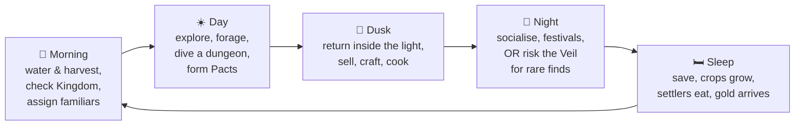

# 03 — Gameplay Systems

> **TL;DR:** A day-based life-sim loop (farm → explore/dive → build → socialise → sleep) wrapped around a kingdom that grows and feeds on everything you do. Each system is simple on its own; the depth comes from how they interlock. All numbers here are **first-pass placeholders** for the grey-box; final balance happens in playtests.
>
> **v0.5:** a **Kingdom View** joins these loops ([D-039](12_DECISIONS_AND_OPEN_QUESTIONS.md#part-a-decision-log)): free building from above and the **Lantern Market** at night, where visitors walk a lit road, shop at your stalls, tip, and ask to settle ([D-041](12_DECISIONS_AND_OPEN_QUESTIONS.md#part-a-decision-log) to [D-043](12_DECISIONS_AND_OPEN_QUESTIONS.md#part-a-decision-log)). Its prototype rules live in [`prototypes/kingdom-view`](../prototypes/kingdom-view); this document gets a Kingdom View section after the playtest.

**Contents**
1. [Game structure](#1-game-structure) · 2. [Core loops](#2-core-loops) · 3. [Time, calendar & weather](#3-time-calendar--weather) · 4. [Player stats & survival](#4-player-stats--survival) · 5. [The Veil, the Realm & Beacons](#5-the-veil-the-realm--beacons) · 6. [Farming](#6-farming) · 7. [Gathering](#7-gathering-foraging-logging-mining) · 8. [Fishing](#8-fishing) · 9. [Crafting & cooking](#9-crafting-stations--cooking) · 10. [Combat](#10-combat) · 11. [Dungeons](#11-dungeons-the-depths) · 12. [Pacts & familiars](#12-pacts--familiars) · 13. [People](#13-people-sworn-settlers--recruitment) · 14. [The Kingdom](#14-the-kingdom) · 15. [Royal systems](#15-royal-systems) · 16. [Expeditions](#16-expeditions) · 17. [Veil Surges](#17-veil-surges) · 18. [Relationships & romance](#18-relationships--romance) · 19. [Economy](#19-economy--trade) · 20. [Player progression](#20-player-progression) · 21. [Difficulty & accessibility](#21-difficulty-modes--accessibility) · 22. [Feature priority](#22-feature-priority-moscow) · 23. [UI/UX & controls](#23-uiux-overview--controls)

---

## 1. Game structure

```
Title → New Game (save slot, difficulty) → Prologue (The Last Decree)
      → Wake at the Ashen Throne → Pond (character creation) → Chapter 1 …
```

- **Open-ended daily life inside a chaptered story.** Chapters unlock regions, dungeons, and recruits; *when* you pursue them is up to you (no hard deadlines, Stardew-style).
- **One continuous save**, auto-saved when you sleep, plus a one-time "suspend" save when quitting mid-day (deleted on load, so it can't be used for save-scumming).

---

## 2. Core loops

### 2.1 Moment-to-moment (seconds)
Move → use a tool or weapon → get a juicy response (particles, sound, number) → collect → repeat.
*The feel target: every swing of the hoe or sword is satisfying on its own.*

### 2.2 Daily loop (one in-game day ≈ 14 real minutes)



### 2.3 Weekly & seasonal loop

A daily loop alone gets stale in about two weeks, so the game layers rhythms on top of it:

| Rhythm | What happens |
|---|---|
| **Daily** | Farm → explore or dive → build → socialise → sleep |
| **Weekly** | Court Day (Sunday, from Village rank) · Mira's caravan (Tue/Fri) · bounty board refresh (Monday) · **Guardian Echo**: re-fight a defeated Guardian with modifiers for rare rewards (a boss-rush beat, EA) · 2 gifts per person · expedition returns |
| **Twice a season** | Festivals · Veil Surges on New Moon nights |
| **Each season** | New crops, forage, and creatures; a Restoration Project milestone; new personal requests from the Sworn · in Winter, the Food Stock challenge |
| **Each chapter** | A new region, dungeon, Regalia, and Sworn · one mystery answered, one new question asked |

### 2.4 Long-term (meta) loop
Recover Regalia → unlock powers and regions → recruit Sworn → raise Kingdom Rank → the Throne grows → the story advances → the final battle is shaped by everything you built.

---

## 3. Time, calendar & weather

| Rule | Value |
|---|---|
| Day length | 06:00 → 02:00 (20 in-game hours) |
| Clock tick | 10 in-game minutes = **7 real seconds** → ~14 real minutes per day (accessibility slider: ×1 / ×1.5 / ×2) |
| Time pauses | In menus, dialogue, cutscenes (single-player) |
| Time in dungeons | Keeps running (a soft timer, as in Stardew's mines) |
| Day phases | Dawn 06–08 · Day 08–17 · Dusk 17–20 · **Gloaming** 20–02 (the Veil rises) |
| Sleep | Before 00:00 = full Energy; 00:00–02:00 = −25% Energy next day; **02:00 = pass out** |
| Week | Monday–Sunday. **Sunday = Court Day** (09:00–12:00, from Village rank) |
| Season | 28 days · 4 seasons · 112-day year |
| Moon | 14-day cycle: Full Moon on days 7 & 21, **New Moon (Surge Night)** on days 14 & 28 |

**Weather** (daily, seeded, with seasonal weights):

| Weather | Effect |
|---|---|
| Sunny | Normal |
| Cloudy | Glimmoth and Umbra creatures appear more often |
| Rain | Waters all crops; Aqua familiars +20% work; fishing bites + |
| Storm | Lightning can strike tall objects; Zephyr creatures +; outdoor work −10% |
| **Fog** | The Veil thickens in daytime: Exposure builds outside the Realm; rare creatures spawn |
| Snow | Winter only; outdoor crops don't grow (except winter crops) |

Forecast: Flicker's (unreliable, funny) guess at first → the **Observatory** (Saga) gives a reliable 3-day forecast (1.0).

---

## 4. Player stats & survival

| Stat | Range | What it does | Restored by |
|---|---|---|---|
| **HP** | 100 → ~300 | Health. 0 = knocked out | Food, potions, Clinic, sleep, resting at springs |
| **Energy** | 100 → ~220 | Spent by tools (2–6 each) and Royal Arts (10–30). ≤0 = *Exhausted* (slow, no tools); ≤−15 = pass out | Sleep (full), food, resting at campfire/bench (slow) |
| **Satiety** | 0–100 | Drains 5/hour. ≥70 **Well-Fed**: +10% max HP & Energy. <25 **Hungry**: tool Energy costs +25%, no HP regen. 0 **Starving**: −2 HP per 10 min, −15% move speed | Eating (raw food small, meals large) |
| **Exposure** | 0–100 (shown only when >0) | Builds outside the light at night, in Fog, deep in dungeons. 40 **Chilled** (−10% speed, whispers). 70 **Veil-touched** (visual distortion, the Hollowed notice you from twice as far). 100 **Veil-struck** (−5 HP per 10 min) | Inside the Realm or near fire: −10 per 10 min |

**Exposure gain (per 10 in-game minutes):** night outside the Realm +4 · Fog outside the Realm +2 · deep dungeon floors +1 to +3 · Winter ×1.5.
**Reducers:** lit hand Lantern ×0.3 · Warmth meal buff ×0.5 · Lumen familiar in party ×0.8 · the Mantle ×0 (×0.3 in the deep Veil).

**Knockouts & pass-outs**

| Situation | You wake… | You lose (Sovereign difficulty) |
|---|---|---|
| 02:00 inside the Realm | At the Throne | Nothing |
| 02:00 outside the Realm | At the Clinic | 10% gold (max 500g) |
| HP 0 in the overworld | At the Clinic, next morning | 10% gold (max 1,000g) |
| HP 0 in a dungeon | At the Clinic ("your familiars dragged you home") | Up to 3 random item stacks gathered on *this dive* (never tools, gear, or key items); the day ends |

> **Why this design:** Valheim-style positive food keeps eating fun, not a chore. Exposure is a **"how far do I push tonight?"** decision, the Don't Starve darkness idea made softer. Both stay mostly at the frontier (see the Frontier Principle in [01_VISION §5](01_VISION.md#5-the-frontier-principle-how-survival-works)).

---

## 5. The Veil, the Realm & Beacons

**The Realm** is your territory: the union of light circles cast by your **Beacon**, **Watchtowers**, and **Waybeacons**.

| Inside the Realm | Outside the Realm |
|---|---|
| No Exposure, no Hollowed spawns (except Surge nights) | Night = Veil, Exposure, Hollowed |
| Land can be purified, farmed, and built on | Land is **Veil-choked** (purple soil, Veil Bramble), no building |
| Settlers and familiars work here | Richer forage, rarer creatures (risk → reward) |

| Beacon tier | Name | Radius (tiles) | Requirement |
|---|---|---|---|
| T1 | Heartflame Brazier | 10 | 20 stone, 10 wood, Flicker's spark (Day 1) |
| T2 | Beacon Tower | 18 | 80 stone, 40 planks, 10 copper bars, 5 Veilglass; Hamlet |
| T3 | Great Beacon | 28 | The Orb; Town |
| T4 | Sunspire | 40 | The Mantle; City |

- **Watchtower:** +8-tile bubble, adds defense. **Waybeacon:** 6-tile bubble along roads, clears **Veil Walls** between regions, and is a fast-travel point.
- **Portable light:** Torches (cheap, 2 in-game hours) and the **Lantern** (fuelled by **Glow Oil**, crafted from Glimmoth dust or Sunfruit). A campfire placed in the wild is a one-night safe bubble (radius 4).
- **Lumen Lamps** (decor): fuel-free once built, radius 3, reduce Exposure, don't extend the Realm.

---

## 6. Farming

**Soil states:** `Veil-choked` → (Realm covers it) → `Wild` (weeds, stones, stumps) → `Tilled` → `Watered`.

- **Crops** grow one stage per watered day; they need water daily unless it rains. A season change kills out-of-season crops (multi-season crops survive).
- **Quality:** Normal · Silver · Gold · **Royal**, affected by Farming level, fertilizer, and luck. Sale multipliers ×1.0 / ×1.25 / ×1.5 / ×2.0.
- **Fertilizers:** Compost (+quality), Moss Fertilizer (from Mossbun fluff: +10% growth speed), Veil Ash (from Hollowed drops: big quality boost), Alchemist tonics (1.0).
- **Royal Fields vs. Commons:**
  - *Royal Fields* are your personal plots. You plant and harvest; the harvest goes to your inventory.
  - *Commons* are worked by settlers and familiars. The harvest goes to the **Granary (Food Stock)** by default; the surplus can auto-sell.
- **Automation:**
  - **Dew Totems** (Workshop, EA): water a cross / 3×3 / 5×5 area.
  - **Familiars** with Tending or Watering assigned to a **Field Post** (work radius 6).

**Fantasy crop rules** (full crop list in [`06_ITEMS_CROPS_RECIPES.md`](06_ITEMS_CROPS_RECIPES.md)):

| Crop | Special rule |
|---|---|
| Dawnbell | Attracts **Glimmoth** to your farm at night |
| Mandrake Root | 5% chance to pull up a **Mandragling** (a creature!) instead of a root |
| Sunfruit | Stores sunlight → **Lumen Essence** (Beacon and Lantern crafting) |
| Emberroot | Spicy; key ingredient for warmth meals and Ignis gear |
| Lanterngourd | Carve into lanterns (Lumen Lamps) |
| Nightcorn | Grows only on **unlit** tiles: a farm-layout puzzle |
| Icebloom | Yields **Chilling Essence** (preservation) |
| **Veil Seeds** (dungeon loot) | Must be within 2 tiles of a Lumen source, or they turn into a hostile **Hollow Sprout** (purify it for a Mandragling). Rare, very valuable crops. |

Fruit trees take 28 days to mature and give fruit daily in their season.

---

## 7. Gathering: foraging, logging, mining

| Activity | Tool | Notes |
|---|---|---|
| Foraging | Hands / Sickle | Spawns per region, season, and weather. Quality scales with Gathering level. Berry bushes are seasonal. |
| Logging | Axe | Trees grow in 3 stages. Large stumps and Veil Trees give Hardwood (needs a better Axe). |
| Mining (overworld) | Pickaxe | Quarry rocks near cliffs; most ore is in dungeons. Pickaxe tier gates harder nodes. |
| Geodes | — | **Veil Geodes** cracked at the Smithy → gems, minerals, Archive donations |

---

## 8. Fishing
*(Early Access)*

- Rod tiers: Bamboo → Copper → Silver → Starmetal.
- **Minigame:** a tension reel. Hold to reel; the line glows red when tension is high, so release. Fish fight in patterns (darting, steady, erratic).
- Fish depend on location, season, time, and weather. 5 legendary fish at 1.0.
- **Tide Traps** (from Orin) passively catch shellfish.

---

## 9. Crafting, stations & cooking

- **Pocket crafting** (anywhere): basic items (torch, campfire, chest, fence, simple tools).
- **Stations** (placed objects): Campfire → Workbench → Cooking Pot / Kitchen, Smelter, Anvil, Loom, Preserves Jar, Keg, Churn, Cheese Press, Mill, Kiln, Enchanting Table, Alchemy Set.
- **Staffed buildings** run **production queues** by themselves when assigned workers and supplied (e.g. the Smithy keeps smelting bars while you're away).
- Stations powered by **Kindling** familiars need no fuel; otherwise they burn coal or charcoal.
- **Recipe sources:** skill levels, Sworn hearts, the Tavern, scrolls found in dungeons, Court Day rewards, Archive research.

**Cooking & food buffs**
- One **food buff** and one **drink buff** at a time.
- Buff families: **Well-Fed** (max HP/Energy), **Warmth** (Exposure resistance), **Might** (ATK), **Guard** (DEF), **Swift** (speed), **Lucky**, **Green Thumb** (farming Energy cost), **Miner's Grit**, **Kindred** (Pact chance).
- Dish quality follows ingredient quality.

---

## 10. Combat

**Real-time top-down action**, readable and juicy, accessible but with a skill ceiling.

| Input | Behaviour |
|---|---|
| Light attack | Up to a 3-hit combo (per weapon type) |
| Heavy / charge | Hold to charge; staggers most enemies |
| **Dodge roll** | i-frames 0.25 s, cooldown 0.6 s, **no Energy cost** |
| **Perfect Dodge** | Dodging within 0.15 s of a hit triggers **Royal Focus**: 1 s slow-motion plus a ×1.5 counter window |
| Parry | Sword & Buckler only: 0.2 s window → enemy staggered |
| Royal Arts | 2 slots (VS) → 4 slots; cost Energy |
| **Command Mode** *(Scepter)* | Hold: time slows to 20%, radial orders for companions: *Focus target · Guard me · Use skill · Fall back · Swap familiar* |
| **Purify** *(Signet)* | A Hollowed at ≤25% HP shows a cracked **Veil Core**. Hold Interact for 1.5 s (interruptible) → it becomes a normal Veilkin (Pact chance +50%) |

**Weapon types**

| Type | Identity | Milestone |
|---|---|---|
| Sword & Buckler | Balanced, parry. The Sovereign's classic style | VS |
| Spear | Reach, dash-thrust charge | VS |
| Greatsword | Slow, huge stagger, charged sweeps | EA |
| Twin Daggers | Fast, crits, backstabs | EA |
| Bow | Ranged, charged shots, infinite basic arrows (special arrows are crafted) | EA |
| Catalyst (staff or tome) | Free basic elemental bolt; charged spells cost Energy | EA |

**Elements & statuses**

| Element | Opposite (×1.5 both ways) | Status inflicted |
|---|---|---|
| Terra | Zephyr | **Root** (immobile 1.5 s) |
| Zephyr | Terra | **Stagger** (knockback + interrupt) |
| Ignis | Aqua | **Burn** (damage over time) |
| Aqua | Ignis | **Soak** (−20% move speed) |
| Lumen | Umbra | **Dazzle** (enemy attacks miss more) |
| Umbra | Lumen | **Fear** (enemy flees 2 s) |
| *Veil* (Hollowed attacks) | Lumen deals ×2 to Veil | **Veil-rot**: −10% max HP until cleansed (sleep, Chapel, potion) |

Same-element hits deal ×0.75. **Placeholder damage formula:** `max(1, ATK × skillMult × elementMult × critMult − DEF × 0.5)`.

**Enemy archetypes:** Chaser · Charger · Ranged · Caster · Tank · Swarm · Ambusher · Summoner · Support. **Elite modifiers:** *Hollowed* (Veil aura, +50% HP, purifiable) and *Alpha* (bigger, new attack).

**Feel checklist:** hitstop (2–4 frames), screen shake (toggleable), knockback, white hit-flash, readable wind-up telegraphs, optional damage numbers.

**Human bosses** end with a **Spare / Banish** choice (see §13).

---

## 11. Dungeons (the Depths)

- **Floors are assembled from hand-made room chunks** (built in Tiled). Each dungeon has 30–60 chunks; a floor links 4–9 rooms. The layout reshuffles daily ("the Veil tides") except on special floors.
- **Goal per floor:** find the **Descent** (stairs), sometimes locked behind *clear the room / solve a puzzle / find the key*.
- **Waystones** every 5 floors act as checkpoints and warps.
- **Exposure** creeps up on deeper floors, a second soft timer alongside the clock.

**Floor types**

| Type | Content | Frequency |
|---|---|---|
| Standard | Combat, ore nodes, forage | Common |
| Treasure Vault | Locked chest + light puzzle | Uncommon |
| Spring | Heal, reduce Exposure, safe | Uncommon |
| **Captive** | Rescue someone → Settler or Sworn (e.g. **Tamsin**) | Scripted + rare random |
| **Nest** | Rare creature or egg | Uncommon |
| Memory Shrine | Memory Fragment | Scripted |
| Veil Rift | Elite challenge, bigger rewards | Rare |
| Lost Merchant | Rare shop | Rare |
| **Guardian** | Boss + Regalia | Last floor |

**Daily dungeon modifiers** (forecast by Saga at 1.0): *Flooded* (more Aqua), *Gloom* (darker, more Umbra), *Bountiful Veins* (more ore), *Restless* (more elites, better loot).

**Party size:** Sovereign + 1 familiar → **+1** with the Scepter → **+1** at City rank = a party of 4. Extra slots take a familiar **or** a companion Sworn. The **12 romanceable Sworn are the companion-capable ones** (they have combat animation sets), so dungeon dives double as time together.

After the Guardian falls, the dungeon is **Tamed**: Expeditions can go there, and post-game **Legend Trials** unlock.

| Dungeon | Floors | Milestone |
|---|---|---|
| Sunken Cellars | 10 + Guardian | VS |
| Rootdeep Labyrinth | 15 + Guardian | EA |
| Drowned Bells | 15 + Guardian | EA |
| The Forgeheart | 20 + Guardian | 1.0 |
| Starfall Spire | 20 + Guardian | 1.0 |
| Halcyon Below | 30 + finale | 1.0 |
| Veil Rifts | Endless (post-game) | 1.0 |

---

## 12. Pacts & familiars

### 12.1 Pact methods

| Method | How | Typical species |
|---|---|---|
| **Subdue** | Lower HP below 30% (the HP bar shows a sigil), then use a **Pact Sigil**. Chance = species base × Sigil tier × (1 + missing HP%) × status bonus × Bonding bonus. On failure it breaks free and may flee. | Aggressive species |
| **Offering** | Approach slowly (crouch-walk), then offer its favourite item with a Sigil. Chance depends on the item and time of day. | Shy or peaceful species |
| **Challenge** | Win a species-specific minigame (race, hide-and-seek, rhythm, mimic guess, constellation trace): guaranteed Pact. | Playful or proud species |
| **Purify** | Purify a Hollowed variant → Pact chance +50%. | Any Hollowed |
| **Hatch** | Incubate an egg in the Den (days) → hatchling at Bond 1. | Nest finds, the Mandrake surprise |
| **Legend Trial** | Post-game challenge. | Guardians |

### 12.2 A familiar's data
Species · element · level (1–50) · HP/ATK/DEF/SPD · **Work Stamina** · **Bond** (0–5) · **work skills** (each Lv 1–3) · 1 passive trait (*Diligent, Glutton, Night Owl, Brave, Timid, Gentle, Quick, Sturdy…*) · 2 active skills (1 species skill + 1 learned) · diet · diurnal or nocturnal.

### 12.3 Work skills (12)

| Skill | What it does in the Realm |
|---|---|
| **Tending** | Tills, plants from a Seed Chest, harvests into a Harvest Chest |
| **Watering** | Waters dry tiles in its radius |
| **Logging** | Chops marked trees |
| **Mining** | Mines rocks and quarry nodes |
| **Hauling** | Moves items from drop points to storage or the Granary |
| **Crafting** | Speeds up station and building production |
| **Kindling** | Powers fire stations (Smelter, Kiln, Kitchen) with no fuel |
| **Chilling** | Slows food spoilage in Granary or cold storage |
| **Lighting** | Assigned to lamps or the Beacon: +radius, less night Exposure |
| **Guarding** | Patrols; defends during Surges; stops pests |
| **Foraging** | Collects forage inside the Realm |
| **Healing** | Speeds injury recovery at the Clinic; heals the party in combat |

- Familiars work 08:00–18:00 (nocturnal ones 20:00–04:00), spend Work Stamina, rest in the Den, and eat from the Den feeder (supplied by the Granary).
- Mood: *Content / Tired / Sulky*. Overworked familiars sulk (refuse work for a day). **They never get sick or die.**
- **Bond** rises from daily petting, favourite food, fighting together, and a comfy Den; it falls from overwork or going unfed.
- A familiar in your **party** doesn't work at home that day: a real trade-off.

### 12.4 Naming & Ascension
- **Naming** (requires the Signet, Bond 5, and 20 Royal Authority): you choose its name → **Ascension** effect → *Named* status: +10% stats, +1 work skill level, a glowing crown mark, and a unique skill.
- **True Ascension** (17 species): a Named familiar plus a regional catalyst item → an **evolved form** with a new sprite. Examples: Mossbun → Grovehare, Emberkit → Blazetail.
- **Mounts** (1.0): three True Ascension forms can be ridden (Thornbeast, Volcanic Ram, Glacier Titan) once Tor's Hunter's Lodge is built.

**Den capacity:** Den T1 4 · T2 8 · T3 16 · Sanctuary 30 active. Extra familiars rest in the **Grove Sanctuary** (stored, not working).

---

## 13. People: Sworn, Settlers & recruitment

### 13.1 Three tiers of people

| Tier | Count (1.0) | What they are | Cost to produce |
|---|---|---|---|
| **Sworn** | 24 | Hand-made named heroes: portraits, story, heart events, 12 romanceable. Each unlocks a building or service. | High |
| **Settlers** | ~60 | Procedurally generated from modular sprite and portrait parts, with attributes, traits, and jobs. The colony-sim layer. | Low |
| **Visitors** | — | Merchants, envoys, story NPCs | Varies |

### 13.2 Settler generation (Dungeon Settlers-inspired)
- **Six attributes (1–10):**

| Attribute | Drives |
|---|---|
| **Might** | Logging, mining, hauling, melee |
| **Finesse** | Crafting speed, archery, fishing |
| **Wits** | Research, alchemy, trade |
| **Grit** | Work hours, injury resistance |
| **Heart** | Cooking, familiar care, morale aura, healing |
| **Spirit** | Exposure resistance, enchanting, Lumen affinity |

- **Race** (unlocked as regions open): Human, Halfling, Elf, Dwarf, Beastfolk, Tidekin, Gnome, Dragonkin. Each has attribute modifiers.
- **Background** (Farmhand, Soldier, Scribe, Sailor, Miner, Veil Orphan, Minstrel…) gives starting skill boosts.
- **Traits** (2–3): 12 in VS → 30 at 1.0. *Hardworking, Lazy, Green Thumb, Strong Back, Night Owl, Early Bird, Beast Friend, Glutton, Cheerful, Gloomy, Brave, Timid*…
- **Favourite food category**, daily schedule (work 08–17, leisure, sleep).

### 13.3 Jobs
Farmer · Forager · Woodcutter · Quarrier · Hauler · Builder · Cook · Smith's Hand · Artisan (runs looms, kegs, jars) · Rancher · Fisher · Guard · Scholar · Healer's Aide · Clerk · Brewer.
Each settler shows a **job affinity** star rating (from attributes and traits). The player sets a job per settler, or leaves it on **Auto**.

### 13.4 How people join
| Route | Examples |
|---|---|
| **Arrivals** | At dawn, if there's a free bed, enough Prosperity, and the realm is safe: 1–2 applicants on the Tavern notice board (accept or decline) |
| **Rescues** | Captives in dungeons; people lost in the Veil at night |
| **Sworn recruit quests** | Each Sworn has a unique quest (see [`04_CHARACTERS.md`](04_CHARACTERS.md)) |
| **Mercy** | Defeated human enemies: **Spare** or **Banish** |

### 13.5 Mercy
- **Spare** → the enemy may join after a trust quest. Builds a *Merciful* reputation: more arrivals, slightly less Safety.
- **Banish** → safer short-term, a *Stern* reputation, and settlers from spared factions arrive less often. **No Sworn is lost for good:** a banished enemy returns later with a different arc (see [14 §9.3](14_NARRATIVE_AND_PROGRESSION.md#93-choices-and-consequences-in-chapter-1)).
- The theme made mechanical: **a crown is held up by many hands, even hands that once fought you.**

---

## 14. The Kingdom

### 14.1 Build mode
Press **B**. Prefab buildings are placed on the tile grid **inside the Realm**, with a ghost preview (green = valid, red = invalid) and a Realm-edge overlay. Costs are materials + gold; construction takes days (faster with Bram, builder settlers, and Crafting familiars). Buildings upgrade **in place**; some tiers need a specific Sworn. Full list: [`07_BUILDINGS_AND_KINGDOM.md`](07_BUILDINGS_AND_KINGDOM.md).

### 14.2 Resident needs (kept light)

| Need | Satisfied by |
|---|---|
| **Food** | A daily ration from the Granary (variety adds Joy) |
| **Rest** | A bed (housing) |
| **Comfort** | Housing tier + decor near home |
| **Joy** | Tavern, Bandstand, Bathhouse, festivals, Decrees |
| **Safety** | Beacon coverage, walls, guards, towers |

**Happiness (0–100)** is a weighted average. It drives work speed (±20%), arrivals, tax income, Sworn Loyalty, and whether an unhappy settler eventually leaves (warned in advance; Sworn never leave).

### 14.3 Food Stock (the Granary)
- Every settler eats **1 ration per day**; familiars 0.5 (diet-specific).
- Ration values: raw crops 0.5–1, cooked dishes 1–3 (+Joy).
- **Spoilage:** raw food loses freshness. Granary tiers, Chilling familiars, and preserved goods (jam, pickles, cheese, flour, bread) stop the clock.
- **Winter:** fields don't grow (except winter crops and the Glasshouse), so **you must stockpile**. Survival, scaled up to the whole kingdom.
- Running out → Joy crashes, work slows, and eventually settlers leave. **Nobody starves to death.**

### 14.4 Prosperity & Kingdom Rank
**Prosperity** is a score from buildings, decor, happiness, population, and trade. Together with population, Sworn count, and story milestones, it drives **Kingdom Rank**:

| Rank | Title | Residents | Sworn | Throne tier | Also needs |
|---|---|---|---|---|---|
| 0 | Exile's Camp | — | — | Ashen Throne (ruin) | — |
| 1 | **Hamlet** | 3 | 2 | Longhouse | Beacon T1 |
| 2 | **Village** | 12 | 5 | Longhouse | The Signet, Beacon T2 |
| 3 | **Town** | 25 | 9 | Stone Keep | The Scepter |
| 4 | **City** | 45 | 15 | Castle | The Orb + the Sunblade |
| 5 | **Kingdom** | 70 | 20 | Palace | The Mantle |

"Residents" counts everyone living in the realm except the Sovereign. The Founding ceremony at Hamlet is where you **name your kingdom and design your banner**.

### 14.5 Taxes (the Tithe)
From Village rank: at dawn, **each settler × 5g × happiness factor (0.5–1.5)** arrives in your gold.

---

## 15. Royal systems

### 15.1 Royal Authority (RA)
A kingly resource. **Max** = 20 + 20 × rank. **Gain:** +1 + rank per day (+ happiness bonus), story beats, Court rulings, purifying the Hollowed.

| Spend on | Cost |
|---|---|
| Naming a familiar | 20 |
| Knighting a Sworn | 40 |
| Changing a Decree | 10 |
| Royal Pardon (special Court option) | 5 |
| Royal Summons (invite a settler with a chosen background) | 15 |

### 15.2 Knighthood
A Sworn with **Hearts ≥ 6** and **Loyalty ≥ 80** can be knighted at the Throne (a vow cutscene). Knights gain a unique **Knight perk** (see the cast bible), can captain Expeditions, and count toward the true ending.

### 15.3 Decrees
Policies with an upside and a downside. **Slots:** Village 1 · Town 2 · City 3 · Kingdom 4. A decree must stay active at least 7 days. The full list is in [`07_BUILDINGS_AND_KINGDOM.md`](07_BUILDINGS_AND_KINGDOM.md#6-royal-decrees).

### 15.4 Court Day
From **Village** rank, every **Sunday 09:00–12:00** at the Throne: 3–5 **petition cards** (Reigns-style choices).

| Petition type | Example |
|---|---|
| Dispute | Two settlers claim the same field plot |
| Request | "The chapel roof leaks. Can the crown spare 30 planks?" |
| Proposal | A settler suggests a new Decree |
| Visitor | An outsider asks to join, a potential recruit |
| Omen | A strange sign in the Veil (foreshadowing) |
| Personal | A Sworn's private problem (can trigger a heart event) |

Outcomes affect happiness, the Loyalty of the Sworn involved, gold, resources, and RA. Skipping Court resolves petitions neutrally, with a small happiness penalty.

### 15.5 Faction Standing
*(Early Access)* A sovereign plays politics. Each faction's **Standing** (−100 to +100: Hostile · Wary · Neutral · Friendly · Allied) rises and falls with your quests, Court rulings, Decrees, and trade. **Helping one side can cool another**, so choices carry weight.

| Faction | Raise Standing by | Perks at Friendly / Allied | Rival |
|---|---|---|---|
| **Order of the Dawn Lantern** | Chapel projects, purifying the Hollowed, Faith-minded rulings | Free cleansing; stronger blessings | The Pale Choir (always hostile) |
| **Whisperwood Fae** | Planting trees, sparing forest creatures, Nature decrees | Rare seeds; hidden forest paths | Aldmark Dominion |
| **Brinemouth Tidekin** | Fishing quests, protecting the coast | Secret fishing spots; sea shrines | Aldmark Dominion |
| **Veil Orphans** (Rook's people) | Mercy rulings, feeding the poor | Scouting intel; cheaper Expeditions | Aldmark Dominion |
| **Aldmark Dominion** | Trade deals, selling Veilglass, diplomacy | Trade routes, Dominion goods, fewer sieges | Fae, Tidekin, Veil Orphans |
| **Emberhold Dwarves** *(1.0)* | Forge work, ale, Restoration Projects | Ore trade, forge secrets | Aldmark Dominion (mines) |

---

## 16. Expeditions
*(Early Access; the Dungeon Settlers layer)*

- At the **Scout's Post**: pick a destination (a cleared floor band or an explored overworld zone), a **party of up to 4** (settlers, Sworn, familiars; not the Sovereign), and supplies (rations, potions). Duration: 1–3 days.
- **Party Power** (attributes, gear, levels, element matchups, trait synergies) vs. **Danger** decides the result: *Triumph / Success / Setback*.
- Setback = fewer rewards plus **injuries** (1–3 days of Clinic rest). **No one dies.**
- Returns materials, ore, gems, seeds, eggs, gold, and XP, with a readable **event log** of small stories (e.g. *"June pacted a Jellop mid-battle!"*).
- Knights as captains add their perks.

---

## 17. Veil Surges
*(Early Access)*

- Surges begin **once the first Regalia (the Signet) is recovered**: taking an anchor weakens the seal (the story reason is revealed in Ch5).
- On **New Moon nights** (days 14 and 28 of each season), announced 3 days ahead by Flicker (later Saga).
- Waves of Hollowed come from the Realm's edges toward the Beacon. Defenses: walls, gates, towers, guard settlers, Guarding familiars, and you.
- **Sleep through it:** auto-resolved (Defense Rating vs. Surge Strength) → possible building and field damage (repairable), stolen Food Stock, injuries.
- **Fight it:** Veilglass, rare materials, bonus RA.
- **Strength scales with Regalia recovered and Kingdom Rank.** (Story reason: each Regalia weakens the seal.)

---

## 18. Relationships & romance

| Rule | Value |
|---|---|
| Hearts | 0–10 (romanceables cap at 8 until dating) · 250 points per heart |
| Talk | +20/day |
| Gifts | Loved +80 · Liked +45 · Neutral +20 · Disliked −20 · Hated −40 · **2 gifts per person per week** · birthday ×5 |
| Decay | Light decay with no interaction, never below 2 hearts |
| Heart events | 2 / 4 / 6 / 8 / 10 hearts, plus **group events** (see the cast relationship map) |
| Dating | Give a **Blossom Brooch** at 8 hearts. Dating more than one person is possible, with consequences in a group event |
| Proposal | **Consort's Ring** at 10 hearts, with the Throne at Stone Keep or above → **Royal Wedding** at the Chapel 3 days later |
| Royal Consort | Your spouse moves into the Keep, helps with daily chores, and grants a unique **Consort perk** |
| Romance options | 12 Sworn, available whatever the player's gender |

**Loyalty (Sworn only), 0–100:**
**50%** from Hearts + **30%** from their own happiness + **20%** from **Royal Standing**. Every Sworn holds 2 **values** (Mercy, Order, Freedom, Tradition, Progress, Prosperity, Faith, Nature, Honor, Family); your Decrees and Court rulings raise or lower their Standing.

---

## 19. Economy & trade

**Currency:** gold (g).

| Sources | Sinks |
|---|---|
| Trade Crate (sold overnight at base price) | Seeds, saplings |
| Mira's caravan (Tue/Fri), later the Market | Building costs, Beacon tiers |
| Tithe (taxes, from Village) | Tool and weapon upgrades (gold + bars + 1–2 days) |
| Expeditions, trade routes (Harbor) | Recipes, decor, clothing |
| Quests, Court rewards | Emergency rations, festival contributions |

- **Market** (EA): a daily shop, plus **Stalls** where settler clerks sell your surplus.
- **Trade Routes** (EA): ship goods to Outer Realm cities for ×1.5–2.5, taking 3–7 days, with risk events.
- **Rough income curve** (to be balanced): early VS ~200–600g/day → mid EA ~2–5k/day → late 1.0 20k+/day.

---

## 20. Player progression

### 20.1 Skills (levels 1–10)

| Skill | Per-level bonus | Level 5 perk choice |
|---|---|---|
| Farming | −Energy cost for hoe and can; +max Energy | **Tiller** (+10% crop value) · **Rancher** (+familiar produce) |
| Gathering | Forage quality; +max Energy | **Woodsman** (+wood, hardwood chance) · **Herbalist** (double forage chance) |
| Mining | −Pickaxe Energy cost; ore bonus | **Prospector** (more gems) · **Smelter** (bars cost less ore) |
| Fishing | Easier reel; rare fish chance | **Angler** (+fish value) · **Trapper** (better Tide Traps) |
| Combat | +max HP; crit chance | **Duelist** (+Perfect Dodge window) · **Guardian** (+DEF, parry heals) |
| Bonding | +Pact chance; Bond gain | **Warden** (familiars +work speed) · **Kin-caller** (party familiars +stats) |

Level 10 perk branches get defined in the balancing pass.

### 20.2 Gear
Tools in 5 tiers (Crude → Copper → Iron → Silver → Starmetal). Weapons: 6 types × 6 tiers, plus the legendary **Sunblade** line. Armor: body + boots + 2 trinkets. Clothing is cosmetic (the Wardrobe).

### 20.3 Royal Arts

| Royal Art | Effect | Unlocked by | Milestone |
|---|---|---|---|
| Sovereign's Strike | Charged Lumen slash | Start (re-learned in Ch1) | VS |
| Rallying Cry | Party ATK up, small heal | Ch1 | VS |
| Aegis of Halcyon | Shield dome that blocks projectiles | Ch2 | EA |
| Royal Command | Command Mode (see §10) | The Scepter | EA |
| Sunburst | Lumen area burst, strong vs. the Veil | The Orb | EA |
| Sunblade Dance | Multi-hit combo finisher | The Sunblade | 1.0 |
| Mantle Ward | 3 s invulnerability + Exposure purge | The Mantle | 1.0 |
| Decree: Kneel | Stuns all non-boss enemies on screen | The Crown | 1.0 |

### 20.4 Crown Embers
10 hidden **Crown Embers** in the world, each +10 max Energy or HP (your choice). Exploration rewards.

---

## 21. Difficulty modes & accessibility

| Setting | Cozy | **Sovereign** (default) | Exile |
|---|---|---|---|
| Satiety | Buffs only (no Hungry/Starving penalties) | Standard | Drains ×1.5 |
| Exposure | Gain ×0.5, no Veil-struck damage | Standard | Gain ×1.5 |
| Knockout losses | None | Standard (§4) | All dive loot + 25% gold |
| Veil Surges | Off | On, telegraphed | Stronger, +1 per season |
| Enemy damage | ×0.6 | ×1.0 | ×1.3 |
| Settlers leaving | Never | After long unhappiness (warned) | Faster |

Players can lower difficulty at any time. Exile can only be chosen at the start.

**Accessibility:** full rebinding, controller support, text size (3 steps), dyslexia-friendly font option, colour-blind-safe element icons (every element has a unique **shape** as well as colour), screen-shake and flash toggles, reduced-motion (disables Veil distortion), hold-vs-toggle options, aim assist, day-length slider, visual indicators for audio cues (e.g. Veil whispers), UI scale, pause anywhere.

---

## 22. Feature priority (MoSCoW)

| Priority | Features | Target |
|---|---|---|
| **Must** | Movement and camera · time, calendar, sleep-save · Energy, Satiety, Exposure · Veil, Realm, Beacon T1–T2 · farming with quality · foraging, wood, stone · Campfire, Workbench, Cooking Pot, Smelter · cooking buffs · combat (Sword & Buckler, Spear, dodge, Perfect Dodge, 2 Royal Arts) · dungeon generator + Sunken Cellars F1–10 + Ruinback · Waystones · Pacts (Subdue, Offering, Purify, Mandrake hatch) · familiar follow/assist + 6 work skills · Naming · build mode + ~14 structures · Settlers (arrival, basic jobs, Food Stock, housing) · 4 Sworn with recruit quests · talk, gifts, hearts, early heart events · Ink dialogue · Kingdom Rank 0→1 · the Founding + simple banner · save/load · Blossomfall Festival · Mira's caravan · Trade Crate · HUD, menus, basic options | **Vertical Slice** |
| **Should** | All seasons and weather · Chapters 1–3 · Court Day · Decrees (6) · Expeditions · fishing · Veil Surges · Restoration Projects · Market & trade routes · Archive research · marriage & Consort · Greatsword, Daggers, Bow, Catalyst · Command Mode · Waybeacons & fast travel · 30 traits · Den upgrades & Sanctuary · **Faction Standing** · **Guardian Echo** · full accessibility · controller · Steam achievements & cloud saves | **Early Access** |
| **Could** | Chapters 4–6 & endings · all 17 True Ascensions · mounts · Arena · Bathhouse · Observatory · full heraldry editor · Event CGs · winter outfits · familiar breeding · photo mode · New Game+ | **1.0** |
| **Won't (for 1.0)** | Multiplayer · children · mod support (post-1.0 goal: Steam Workshop; the data-driven architecture keeps this possible) · console ports (evaluated after 1.0) · voice acting | Later / never |

---

## 23. UI/UX overview & controls

### 23.1 HUD layout (1920×1080 reference)

```
┌──────────────────────────────────────────────────────────────┐
│ [Quest tracker ▾]                       [Spring 3 · Tue ☀️]  │
│                                          [ 14:20 ]  [ 1,240g ]│
│ [🐾 Familiar HP]                                             │
│ [🐾 Familiar HP]                        (toast notifications)│
│                                                              │
│                         (world)                              │
│                                                              │
│                                      [Exposure ▮▮▯] (context)│
│        [Arts Q][Arts R]  [1][2][3][4][5][6][7][8][9][0] [🍲] │
│                                                  ❤ ▮▮▮▮▮▯    │
│                                                  ⚡ ▮▮▮▮▯▯    │
└──────────────────────────────────────────────────────────────┘
```

### 23.2 Menus (Tab)
**Inventory · Crafting · Kingdom** (Overview · Residents · Familiars · Buildings · Decrees · Expeditions) **· Relationships · Compendium** (Creatures · Items · Recipes · Fish · Memories) **· Journal** (Quests · Petitions) **· Map · Settings**

### 23.3 Special screens
- **Dialogue:** bottom box with a portrait on the left, a name plate, choices, and per-character voice blips.
- **Court Day:** throne-room scene with petition cards.
- **Build mode:** category tabs, ghost placement, Realm overlay, upgrade / move / demolish.
- **Pact:** a sigil icon on the enemy HP bar when it's Pact-ready, plus a context prompt.

### 23.4 Controls (first pass; finalised in Step 5)

| Action | Keyboard & mouse | Gamepad (Xbox layout) |
|---|---|---|
| Move | WASD | Left stick |
| Aim | Mouse | Right stick (or aim assist) |
| Use tool / attack | Left click | X |
| Heavy / charge | Hold left click | Hold X |
| Interact / talk / harvest | E or right click | A |
| Dodge | Space | B |
| Sprint | Shift (toggle option) | L3 |
| Royal Arts | Q / R (then Z / C) | RT + face button |
| Command Mode | Hold F | Hold LT |
| Pact Sigil | G | Y |
| Hotbar | 1–0, mouse wheel | LB / RB |
| Menu | Tab | Menu |
| Build mode | B | D-pad up |
| Map / Journal | M / J | D-pad down / left |
| Pause | Esc | View |
