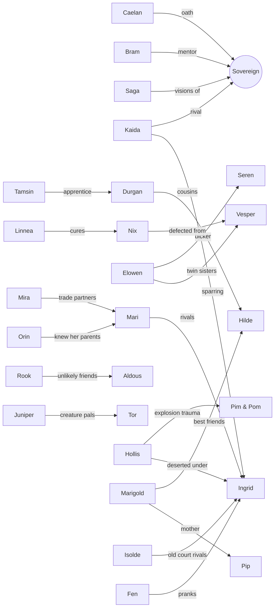

# 04 — Characters (Cast Bible)

> **TL;DR:** The player (the reborn **Sovereign**), the guide **Flicker**, **24 Sworn** (named recruits: each has a job, a building, a recruit quest, a Knight perk, and 12 are romanceable), the antagonists, and the rules for generating **Settlers**. Every Sworn is built to be **distinct in silhouette, voice, and role**.

---

## 1. Cast at a glance

| # | Sworn | Epithet | Race | Role → Building | ♥ | Chapter | Milestone |
|---|---|---|---|---|---|---|---|
| 1 | **Bram Holloway** | The Old Oak | Human | Master Carpenter → **Carpenter's Lodge** | — | 1 | VS |
| 2 | **Linnea Marsh** | The Quiet Remedy | Human | Herbalist & Healer → **Clinic** | ♥ | 1 | VS |
| 3 | **Rook** | The Crowfeather | Human | Scout, ex-bandit → **Scout's Post** | ♥ | 1 | VS |
| 4 | **Tamsin Hale** | Sparks | Human | Blacksmith → **Smithy** | ♥ | 1 | VS |
| 5 | **Juniper "June" Thistle** | — | Halfling | Beast Warden → **Den / Sanctuary** | — | 1 | EA |
| 6 | **Marigold "Goldie" Fenn** | — | Human | Cook & Innkeeper → **Tavern** | — | 1 | EA |
| 7 | **Elowen Starling** | The Last Archivist | Elf | Archivist → **Royal Archive** | ♥ | 2 | EA |
| 8 | **Fen Thornwhistle** | — | Faun | Druid → **Grove Nursery** | — | 2 | EA |
| 9 | **Mira Caravel** | The Veilrunner | Human | Merchant → **Market** | — | 1 (visits) / 2 (joins) | VS visitor / EA |
| 10 | **Brother Aldous** | The Lantern Monk | Human | Chaplain → **Chapel of Dawn** | — | 2 | EA |
| 11 | **Nix** | The Unsung | Human (Veil-marked) | Enchanter, Choir defector → **Enchanter's Spire** | ♥ | 2 | EA |
| 12 | **Marisol "Mari" Vega** | The Stormbreaker | Human | Sea Captain → **Harbor** | ♥ | 3 | EA |
| 13 | **Orin Tidewell** | Old Salt | Tidekin | Fisher → **Fishery** (in the Harbor) | — | 3 | EA |
| 14 | **Seren Aldwyn** | Silver-Tongued | Half-elf | Bard → **Bandstand** | ♥ | 3 | EA |
| 15 | **Pim & Pom Cogsworth** | The Tinker Twins | Gnomes | Tinkers → **Workshop** | — | 3 | EA |
| 16 | **Durgan Anvilborn** | The Mountain's Hammer | Dwarf | Master Smith → **Great Forge** | — | 4 | 1.0 |
| 17 | **Kaida Emberscale** | The Crimson Rival | Dragonkin | Champion → **Arena** | ♥ | 4 | 1.0 |
| 18 | **Hollis Crane** | The Sleepless Scholar | Human | Alchemist → **Alchemist Lab** | ♥ | 4 | 1.0 |
| 19 | **Hilde Stonebrew** | Mother of Ale | Dwarf | Brewer → **Brewery** | — | 4 | 1.0 |
| 20 | **Ingrid Valk** | The Iron Rose | Human | Knight-Commander, Dominion defector → **Barracks** | ♥ | 4 | 1.0 |
| 21 | **Saga Frostmere** | The Star-Reader | Human (Rime folk) | Seer → **Observatory** | — | 5 | 1.0 |
| 22 | **Tor Greymane** | The Silent Fang | Wolfkin | Hunter → **Hunter's Lodge** | ♥ | 5 | 1.0 |
| 23 | **Isolde de Veyne** | The Silk Countess | Human | Couturier → **Tailor's House** | — | 5 | 1.0 |
| 24 | **Sir Caelan Ashford** | The Ashen Warden | Human (Veil-sustained) | Royal Knight-Captain → **Hall of Knights** | ♥ | 6 | 1.0 |

**Romance options (12):** Linnea, Tamsin, Elowen, Mari, Kaida, Ingrid · Rook, Seren, Hollis, Tor, Caelan · Nix. All are available whatever the player's gender. Six are women, five are men, and Nix is nonbinary (they/them).

**Enemies who become Sworn:** Rook (bandit), Nix (Pale Choir), Ingrid (Dominion), Caelan (the Ashen Warden). **Dominion defectors:** Bram, Hollis, Ingrid, Isolde.

---

## 2. The Sovereign (player character)

| | |
|---|---|
| Name | Player-chosen |
| Title | King / Queen / Monarch (player-chosen) |
| Pronouns | he / she / they |
| Age | ~20 (reborn body) |
| Starting outfit | *Tattered Royal Garb*: a faded royal coat, patched and muddy |
| Signature prop | A crude stick-sword, later the Sunblade |

**Customization (pond creator):** body frame A/B (not gender-locked) · 8 skin tones · hair styles (6 VS → 16 at 1.0) · 12 hair colours (including anime colours) · 10 eye colours · 4 eye shapes · accessories later via the Tailor.

**Personality (for writing):** the player chooses tone in key dialogue: **Regal** (dignified), **Warm** (kind), or **Wry** (dry humour). No option makes the Sovereign cruel. Mercy and firmness are both valid ways to rule.

---

## 3. Flicker, the guide

| | |
|---|---|
| What | The last spark of the Heartflame: a palm-sized floating flame with a tiny golden crown and big expressive eyes |
| Personality | Snarky, dramatic, gluttonous (eats Lumen crystals like candy), fiercely loyal, secretly scared of being forgotten |
| Voice markers | Exclamations, food metaphors, nicknames for you (*"Your Crispiness"*, *"Majesty"* when serious) |
| Function | Tutorial guide, hint system, comic relief, emotional core; grows with each Regalia (see [02 §7](02_STORY_AND_WORLD.md#7-the-regalia)) |
| Secret | Carries the memory of the Last Decree, hidden because your past self asked it to |
| Sprite | 16×16 floating, idle bob + 6 emotes; grows slightly and gains flame layers per Regalia |
| Portrait | 8 expressions + **Hungry** + **Sheepish** + **True Form** (Ch6) |

> *"Oh good, you're not dead. Again."* (first line)

---

## 4. The Sworn: profiles

> Format: **values** are used by the Loyalty system ([03 §18](03_GAMEPLAY_SYSTEMS.md#18-relationships--romance)); **Knight perk** unlocks when knighted; **Consort perk** only for romanceables who marry the Sovereign.

### Chapter 1: Dawnmere Vale

#### 1. Bram Holloway, "The Old Oak"
| Human · 58 · he/him | Birthday **Autumn 2** | Values: Family, Tradition | ♥ No |
|---|---|---|---|

- **Role:** Master Carpenter → **Carpenter's Lodge** (construction and all building upgrades).
- **Personality:** gruff, dry humour, dad jokes delivered deadpan; secretly sentimental. The lone survivor of a Dominion expedition lost 12 years ago, he's lived alone in the Windmill Ruin ever since.
- **Voice markers:** short sentences, calls the player "kid" (then "Your Majesty", reluctantly), measures everything in "planks".
- **Recruit (tutorial, Day 3):** found injured at the Windmill Ruin. Bring 3 Healing Herbs and a cooked meal.
- **Gifts:** ♥ Hardwood, Fish Stew, Black Tea · 👍 planks, carved figurines · 👎 Gel, flowers ("waste of good soil").
- **Arc:** accepting that he stopped waiting for rescue; building something that will outlast him.
- **Knight perk, Master Builder:** construction time −50%.
- **Visual:** stocky, grey beard, bald under a bandana, leather apron, pencil behind the ear. Signature colours: **brown & forest green**. Prop: hammer.

#### 2. Linnea Marsh, "The Quiet Remedy"
| Human · 24 · she/her | Birthday **Spring 5** | Values: Mercy, Nature | ♥ Yes |
|---|---|---|---|

- **Role:** Herbalist & Healer → **Clinic** (revives after knockouts, treats injuries, early potions).
- **Personality:** gentle, soft-spoken, notices everything; brave when it matters. Carries guilt for the village she couldn't save from the Hollowing.
- **Voice markers:** herb metaphors, trailing sentences ("…if that's alright"), rare sharp honesty.
- **Recruit (Day 5, "The Lost Healer"):** surrounded by Hollowed at the Ruined Chapel at dusk. Keep the fire alive until dawn.
- **Gifts:** ♥ Dawnbell, Honey Tea, Moonpetal · 👍 herbs, flowers, poetry · 👎 Emberroot, junk.
- **Arc:** forgiving herself; later, curing Nix's Hollowing becomes her personal victory.
- **Knight perk, Field Medic:** the party slowly regenerates HP in dungeons.
- **Consort perk, Morning Tonic:** you start every day Well-Fed.
- **Visual:** ash-blonde braid woven with small flowers, sage-green shawl, herb satchel. Colours: **sage & cream**. Prop: mortar and pestle.

#### 3. Rook, "The Crowfeather"
| Human · 26 · he/him | Birthday **Summer 3** | Values: Freedom, Family | ♥ Yes |
|---|---|---|---|

- **Role:** Scout → **Scout's Post** (map reveal, bounty board; **Expeditions** in EA).
- **Personality:** cocky, sarcastic, allergic to authority, and the most loyal person in the Veil. He robbed caravans only to feed the orphans of his gang.
- **Voice markers:** nicknames for everyone ("Your Royal Muddiness"), deflects with jokes, gets quiet when sincere.
- **Recruit (Days 7–9): the enemy-recruit showcase.** The Crowfeather Gang raids your stores. Defeat Rook in a duel → **Spare** → *Rook's Trial*: stock enough food to feed his gang for a week. Rook and 3 bandits (Magpie, Jackdaw, Finch) join as Sworn and settlers.
- **Gifts:** ♥ Apple Pie, Crow-Feather Charm, Gold Nugget · 👍 fruit, spicy food · 👎 cabbage, Aldous's sermons.
- **Arc:** learning that belonging to a kingdom isn't the same as kneeling to one.
- **Knight perk, Shadowstep Scout:** Expeditions +25% loot; reveals dungeon floor maps.
- **Consort perk, Night Watch:** stops pests and theft; defends one Surge wave for free.
- **Visual:** messy black hair with one white streak, crow-feather cloak, scar across the nose, twin daggers. Colours: **black & crimson**.

#### 4. Tamsin Hale, "Sparks"
| Human · 22 · she/her | Birthday **Autumn 6** | Values: Progress, Honor | ♥ Yes |
|---|---|---|---|

- **Role:** Blacksmith → **Smithy** (tool upgrades, weapons, ingot smelting; tiers 1–3).
- **Personality:** tall, muscular, and painfully shy with people (stammers), but confident and loud at the forge. Secretly sews plush creatures (gap moe). A Dominion smith's apprentice who was left behind.
- **Voice markers:** "Um—" with strangers; technical, excited run-on sentences about metal.
- **Recruit (Sunken Cellars, floor 3):** a scripted **Captive** floor. Rescue her, then bring 10 Copper Ore to rebuild her forge.
- **Gifts:** ♥ Iron Bar, handmade Plush Mossbun, Strawberry Shortcake · 👍 ores, gems, sweets · 👎 rain, fish.
- **Arc:** finding her own voice; later, earning Durgan's respect as a master.
- **Knight perk, Forge Blessing:** crafted weapons have a chance of +1 quality.
- **Consort perk, Hot Iron:** tool upgrades finish instantly.
- **Visual:** auburn hair tied back, freckles, soot smudges, heavy gloves, a cute creature patch on her apron. Colours: **orange & charcoal**. Prop: hammer and tongs.

#### 5. Juniper "June" Thistle
| Halfling · 21 · she/her | Birthday **Spring 10** | Values: Nature, Freedom | ♥ No |
|---|---|---|---|

- **Role:** Beast Warden → **Den** upgrades → **Sanctuary** (familiar care, eggs and hatching, ranch produce, Bond boosts).
- **Personality:** genki, loud, creature-obsessed; talks to familiars more than people; surprisingly wise about loss.
- **Voice markers:** "Ooh!", creature sound effects, gives every creature a nickname.
- **Recruit:** a Hollowed boar scattered her Mossbun herd. Round them up (herding mini-quest), then purify the boar.
- **Gifts:** ♥ Creature Treat, Carrot Cake, Rainbow Shell · 👍 fruit, creature items · 👎 Chompkin (it bit her once).
- **Arc:** the herd she lost as a child; learning to let familiars go on adventures.
- **Knight perk, Beast Friend:** familiar Bond gain +50%.
- **Visual:** short; bright teal hair in twin puffs; freckles; overalls; a Mossbun peeking out of her satchel. Colours: **teal & yellow**.

#### 6. Marigold "Goldie" Fenn
| Human · 34 · she/her | Birthday **Summer 25** | Values: Family, Prosperity | ♥ No |
|---|---|---|---|

- **Role:** Cook & Innkeeper → **Tavern** (meals, recipes, settler happiness, the arrivals notice board, rumours).
- **Personality:** warm, teasing big-sister energy, sharp tongue, fiercely protective of her son **Pip (8)**. Widowed.
- **Voice markers:** "Sweetheart", "Eat first, talk later", cooking idioms.
- **Recruit:** her cart is stuck in the Veil at dusk. Escort Marigold and Pip home, then build a Kitchen.
- **Gifts:** ♥ Fresh Milk, Butter, Exotic Spice · 👍 ingredients, compliments · 👎 raw ore, junk.
- **Arc:** letting herself be cared for, too.
- **Knight perk, Hearth Keeper:** meal buffs last 50% longer; Granary spoilage −50%.
- **Visual:** golden hair in a messy bun, marigold flower pin, rolled sleeves, apron. Colours: **marigold yellow & warm red**.

### Chapter 2: Whisperwood

#### 7. Elowen Starling, "The Last Archivist"
| Elf · ~1,100 (looks 25) · she/her | Birthday **Winter 3** | Values: Tradition, Order | ♥ Yes |
|---|---|---|---|

- **Role:** Archivist → **Royal Archive** (collections, lore, research, Memory Fragment translation).
- **Personality:** aloof, precise, tsundere. Served as a junior archivist in your old court and **has waited a thousand years for you**; she knows who you are from the first meeting and refuses to say. Twin sister of **Vesper**.
- **Voice markers:** precise vocabulary, sighs ("*Honestly.*"), corrects your grammar; slips into warmth, then covers it.
- **Recruit:** in the Rootdeep Labyrinth's sealed library (floor 5), answer her riddles using what you've learned from Memory Fragments.
- **Gifts:** ♥ Ancient Tome, Moonpetal, Black Tea · 👍 books, gems, silence · 👎 mud, Seren's songs.
- **Arc:** a thousand years of grief; choosing between her sister and her sovereign; learning to live in the present.
- **Knight perk, Loremaster:** research cost −30%; reveals hidden dungeon rooms.
- **Consort perk, Archivist's Insight:** +daily Lore; Memory Fragments show extra scenes.
- **Visual:** silver-white long hair, violet eyes, a star-shaped hairpin, navy scholar robes with gold trim, reading glasses on a chain. Colours: **navy & silver**.

#### 8. Fen Thornwhistle
| Faun · appears ~30 · he/him | Birthday **Spring 17** | Values: Nature, Freedom | ♥ No |
|---|---|---|---|

- **Role:** Druid → **Grove Nursery** (fruit trees, rare seeds, Veil Seed germination, soil purification).
- **Personality:** a playful trickster who speaks in rhyme when excited, fiercely protective of the forest, tests everyone with pranks.
- **Voice markers:** rhymes, riddles, laughs at his own jokes.
- **Recruit:** win his game of **"Three Pranks"**: find him three times across Whisperwood (hide-and-seek).
- **Gifts:** ♥ Wildflower Honey, Golden Acorn · 👍 fruit, flowers, music · 👎 axes, cut logs.
- **Arc:** the forest's memory of Halcyon; whether the forest can trust a crown again.
- **Knight perk, Verdant Oath:** crops inside the Realm grow 10% faster.
- **Visual:** curly moss-green hair, small horns, goat legs, a leaf cloak, a reed flute. Colours: **leaf green & bark brown**.

#### 9. Mira Caravel, "The Veilrunner"
| Human · 28 · she/her | Birthday **Autumn 11** | Values: Prosperity, Freedom | ♥ No |
|---|---|---|---|

- **Role:** Merchant → **Market** (daily shop, stalls, trade routes, rare goods).
- **Personality:** bubbly, money-motivated, fearless; knows secret paths through the Veil; teases you about "royal budgets".
- **Voice markers:** prices in every sentence, "Darling!", haggling as flirting with the concept of money.
- **Intro:** Chapter 1 (VS) as the travelling caravan on **Tue/Fri** with her pack-beast **Humphrey** (a Veilkin). **Joins** in Chapter 2 once you reach Village rank and build a Market plot.
- **Gifts:** ♥ Sunstone, Exotic Spice · 👍 gems, rare goods · 👎 cheap junk.
- **Knight perk, Golden Ledger:** sell prices +10%.
- **Visual:** tan skin, dark wavy hair in a coin-studded headscarf, goggles, many pouches. Colours: **saffron & teal**.

#### 10. Brother Aldous, "The Lantern Monk"
| Human · 46 · he/him | Birthday **Spring 26** | Values: Faith, Mercy | ♥ No |
|---|---|---|---|

- **Role:** Chaplain → **Chapel of Dawn** (weekly blessings, cleansing Veil-rot, festivals, **weddings**).
- **Personality:** jovial, big-bellied, loud laugh, terrible puns; an ex-soldier who's still very strong. His order kept the prophecy of the Returning Sovereign, so **he believes in you immediately**.
- **Voice markers:** blessings mixed with jokes, "Ha!", light and lantern metaphors.
- **Recruit:** defend his lone light-shrine in Whisperwood from Pale Choir acolytes.
- **Gifts:** ♥ Bread, Honey Mead, Lanterngourd · 👍 food, candles · 👎 Umbra items, the Pale Choir.
- **Knight perk, Dawn's Grace:** Exposure gain −25% realm-wide; Surges weaker.
- **Visual:** bald, bushy red beard, orange monk robes, a huge lantern-staff. Colours: **orange & gold**.

#### 11. Nix, "The Unsung"
| Human (Veil-marked) · 23 · they/them | Birthday **Autumn 25** | Values: Freedom, Mercy | ♥ Yes |
|---|---|---|---|

- **Role:** Enchanter → **Enchanter's Spire** (Pact Sigil upgrades, enchanting, Veilglass refining).
- **Personality:** guarded, deadpan, edgy vocabulary; secretly a huge nerd who names every spell. Afraid of their Veil-mark growing. The Pale Choir strips its members of their names; "Nix" means *nothing*, and they chose it.
- **Voice markers:** dramatic spell names, deadpan one-liners, ellipses; slowly opens up.
- **Recruit (Chapter 2 mini-boss):** sent to sabotage your Beacon. Defeat them → **Spare** → they're Hollowing. Linnea's Clinic must cure them.
- **Key moment:** at Knighting, the Sovereign offers a true name. Nix can keep "Nix": *"It's mine now."*
- **Gifts:** ♥ Veilglass, Bittersweet Chocolate, Shadow Plum · 👍 crystals, sweets, cats (Nyxcat!) · 👎 bright light, crowds, bells.
- **Knight perk, Unwoven:** Pact chance +15%; Sigils cost 1 less Veilglass.
- **Consort perk, Veilsight:** the Hollowed show on the map at night; +5% Pact chance.
- **Visual:** pale lavender hair covering one eye, glowing Veil-mark tattoos on one arm, a torn white Choir robe re-dyed black. Colours: **black & lilac**.

### Chapter 3: Saltglass Coast

#### 12. Marisol "Mari" Vega, "The Stormbreaker"
| Human · 29 · she/her | Birthday **Summer 9** | Values: Freedom, Prosperity | ♥ Yes |
|---|---|---|---|

- **Role:** Sea Captain → **Harbor** (sea trade routes, sea expeditions, sea access to Cinderpeak).
- **Personality:** loud, bold, flirty, laughs at danger; secretly afraid of being tied down. Her ship, the *Gull's Gamble*, is wrecked on the coast.
- **Voice markers:** sailor slang, "Ha!", bets on everything.
- **Recruit:** repair her ship (planks, cloth, iron), then take back her crew's anchor from the Hollowed in a sea cave.
- **Gifts:** ♥ Spiced Rum, Pearl, Grilled Fish · 👍 fish, treasure, spicy food · 👎 rules, paperwork, Ingrid.
- **Knight perk, Tidewalker:** trade route income +20%.
- **Consort perk, Fair Winds:** trade routes return a day early.
- **Visual:** dark skin, long locs threaded with sea-glass beads, captain's coat, tricorn with a gull feather, a scar over one eyebrow. Colours: **navy, gold & red**.

#### 13. Orin Tidewell, "Old Salt"
| Tidekin · 71 · he/him | Birthday **Autumn 19** | Values: Tradition, Nature | ♥ No |
|---|---|---|---|

- **Role:** Fisher → **Fishery** (rod upgrades, bait, Tide Traps, a fish pond, the aquarium wing in the Archive).
- **Personality:** laconic, patient, speaks in fishing proverbs; knew Mari's parents.
- **Recruit:** catch the legendary **Glassback Carp** with him (fishing tutorial).
- **Gifts:** ♥ rare fish, Seaweed Tea · 👍 fish, bait, tea · 👎 Emberroot, noise.
- **Knight perk, Angler's Patience:** easier fishing; more rare fish.
- **Visual:** grey-blue skin, fin-ears, gills, a white beard braided with shells, straw hat, bare feet. Colours: **sea blue & straw**.

#### 14. Seren Aldwyn, "Silver-Tongued"
| Half-elf · 27 · he/him | Birthday **Spring 19** | Values: Freedom, Progress | ♥ Yes |
|---|---|---|---|

- **Role:** Bard → **Bandstand** (festivals, morale, song buffs, composes your **kingdom's anthem**).
- **Personality:** a flirty, dramatic charmer; secretly lonely and insecure. Wants to write the ballad of your reign.
- **Voice markers:** rhyming compliments, theatrical pauses, "Darling Majesty".
- **Recruit:** win back his lute in a **duel of verses** (rhythm minigame) against a pirate.
- **Gifts:** ♥ Golden Lute String, Wine, Blossom Honey · 👍 wine, flowers, jewellery · 👎 bland food, Elowen's critiques.
- **Knight perk, Anthem of the Realm:** settler happiness +10; better festival rewards.
- **Consort perk, Serenade:** +Joy realm-wide; one Court petition a week resolves favourably.
- **Visual:** long wavy platinum-blond hair with a side braid, pointed ears, teal feathered hat, flamboyant coat. Colours: **teal & cream**.

#### 15. Pim & Pom Cogsworth, "The Tinker Twins"
| Gnomes · 33 · he/him & she/her | Birthday **Spring 23** | Values: Progress, Family | ♥ No |
|---|---|---|---|

- **Role:** Tinkers → **Workshop** (automation: Dew Totems, Hauler Posts, auto-feeders, the town Clocktower).
- **Personality:** finish each other's sentences. **Pim** is the reckless inventor; **Pom** is the careful engineer. Explosions are frequent.
- **Recruit:** gather their prototype parts scattered along the coast (collect-a-thon).
- **Gifts:** ♥ Brass Gear, Iron Bar, Cheese · 👎 water near machines.
- **Knight perk (shared), Clockwork Kingdom:** automation range +1 tile.
- **Visual:** tiny, huge goggles, red-haired Pim and blue-haired Pom in matching overalls. Colours: **brass with red / blue**.

### Chapter 4: Cinderpeak Highlands

#### 16. Durgan Anvilborn, "The Mountain's Hammer"
| Dwarf · 162 · he/him | Birthday **Autumn 23** | Values: Tradition, Honor | ♥ No |
|---|---|---|---|

- **Role:** Master Smith → upgrades the Smithy to the **Great Forge** (tiers 4–5, legendary weapons, the Sunblade).
- **Personality:** proud, stubborn, honour-bound, weeps at fine craftsmanship. Becomes Tamsin's mentor; they bicker, then bond.
- **Recruit:** recover his ancestral hammer from the Forgeheart (floor 10) **and** show him Tamsin's best work.
- **Gifts:** ♥ Emberite Bar, Stonebrew Ale, Mushroom Pie · 👍 gems, ores · 👎 flimsy tools, elves (joking).
- **Knight perk, Heartforge:** unlocks masterwork weapon crafting.
- **Visual:** massive braided red-grey beard with iron rings, tattooed bald head, an iron prosthetic hand. Colours: **rust & iron**.

#### 17. Kaida Emberscale, "The Crimson Rival"
| Dragonkin · 25 · she/her | Birthday **Summer 15** | Values: Honor, Freedom | ♥ Yes |
|---|---|---|---|

- **Role:** Champion → **Arena** (sparring, combat challenges, familiar duels, weapon training).
- **Personality:** hot-blooded, competitive, blunt; the classic rival who becomes your closest ally.
- **Voice markers:** everything is a challenge ("Bet you can't…"), laughs mid-fight.
- **Recruit:** beat her in three escalating duels.
- **Gifts:** ♥ Spicy Curry, Emberroot, Ruby · 👍 spicy food, weapons · 👎 the cold, losing, frilly things.
- **Knight perk, Dragon's Pride:** the Sovereign's crit damage +20%.
- **Consort perk, Sparring Partner:** daily Combat XP + a small ATK buff.
- **Visual:** red scales on cheeks and arms, horns, a tail, spiky crimson hair, battle-scarred armour. Colours: **red, black & gold**.

#### 18. Hollis Crane, "The Sleepless Scholar"
| Human · 27 · he/him | Birthday **Summer 22** | Values: Progress, Mercy | ♥ Yes |
|---|---|---|---|

- **Role:** Alchemist → **Alchemist Lab** (potions, fertilizers, Veil tonics, research into curing the Hollowing).
- **Personality:** nervous, fast-talking genius who forgets to sleep and misreads social cues; very sweet. A Dominion deserter who refused to weaponise Veilglass.
- **Recruit:** break him out of Dominion custody in Cinderpeak (escape quest).
- **Gifts:** ♥ Emberbean Coffee, rare crystals, Blueberry Muffin · 👍 minerals, books · 👎 explosions (Pim & Pom…), bugs.
- **Knight perk, Philosopher's Touch:** potion effects +50%.
- **Consort perk, Lab Leftovers:** a random potion appears in your chest each morning.
- **Visual:** messy dark hair, round glasses, an oversized lab coat with burn holes, ink-stained fingers. Colours: **white & brown**.

#### 19. Hilde Stonebrew, "Mother of Ale"
| Dwarf · 98 · she/her | Birthday **Summer 18** | Values: Family, Prosperity | ♥ No |
|---|---|---|---|

- **Role:** Brewer → **Brewery** (ale, wine, mead, juice; festival drinks).
- **Personality:** jolly, motherly, the loudest laugh in the realm; Durgan's cousin; the realm's self-appointed **matchmaker**.
- **Recruit:** restore her family's hot-spring barrel cellar (deliver barley, honey, and stone).
- **Gifts:** ♥ Golden Hops, Honey · 👎 plain water ("that's for fish!").
- **Knight perk, Cheers to the Crown:** artisan goods +15% value.
- **Visual:** stout, huge braided blonde buns, rosy cheeks, an apron hung with mugs. Colours: **amber & brown**.

#### 20. Ingrid Valk, "The Iron Rose"
| Human · 31 · she/her | Birthday **Winter 10** | Values: Order, Honor | ♥ Yes |
|---|---|---|---|

- **Role:** Knight-Commander → **Barracks** (guards, defense assignments, knight training, Surge defense).
- **Personality:** stern, disciplined, honourable to a fault; her dry humour surprises everyone. Leads the Dominion Expedition Corps until the Dominion orders her to burn your village.
- **Recruit (Chapter 4 climax):** boss battle → **Spare** → she defects when your realm proves it protects its people.
- **Gifts:** ♥ Black Tea, Whetstone, plain bread · 👍 weapons, order, tea · 👎 Mari, Fen's pranks.
- **Knight perk, Iron Discipline:** guards +30% DEF; Surge waves −1.
- **Consort perk, Iron Resolve:** +DEF for the day after she sees you off.
- **Visual:** tall, platinum-blonde undercut, steel-blue eyes, Dominion plate repainted in your banner's colours, a rose engraved on the pauldron. Colours: **steel & crimson**.

### Chapter 5: Frostveil Reaches

#### 21. Saga Frostmere, "The Star-Reader"
| Human (Rime folk) · 24 · she/her | Birthday **Winter 12** | Values: Faith, Nature | ♥ No |
|---|---|---|---|

- **Role:** Seer → **Observatory** (3-day weather forecast, daily luck, Surge and dungeon-modifier forecasts, star events).
- **Personality:** dreamy, speaks in half-prophecies, very kind, sleeps all day. Has visions of your past life.
- **Recruit:** escort her through a blizzard to the Starfall Crater to witness a star-fall (Exposure survival challenge).
- **Gifts:** ♥ Stardust, Snowberry Jam · 👎 mornings, loud noises.
- **Knight perk, Stargazer:** daily luck +; forecasts a week ahead.
- **Visual:** long pale-blue hair with star beads, fur-lined white robes, sleepy half-lidded eyes. Colours: **ice blue & white**.

#### 22. Tor Greymane, "The Silent Fang"
| Wolfkin · 32 · he/him | Birthday **Winter 17** | Values: Nature, Family | ♥ Yes |
|---|---|---|---|

- **Role:** Hunter → **Hunter's Lodge** (bounties on Hollowed Alphas, rare-creature tracking, **mounts**).
- **Personality:** stoic, few words, a gentle giant with children and creatures; lost his pack to the Hollowing.
- **Recruit:** track and **purify** the Hollowed Alpha that was once his packmate.
- **Gifts:** ♥ Smoked Fish, Snowberry, a handmade Scarf · 👎 crowds, perfume.
- **Knight perk, Keen Tracker:** rare creature spawns +50%; mounts ride 20% faster.
- **Consort perk, Hunter's Share:** occasional rare materials as gifts; Offering Pacts easier.
- **Visual:** very tall, grey wolf ears and tail, long silver-grey hair tied back, fur mantle, a scar across one eye. Colours: **grey & dark blue**.

#### 23. Isolde de Veyne, "The Silk Countess"
| Human · 30 · she/her | Birthday **Winter 20** | Values: Prosperity, Tradition | ♥ No |
|---|---|---|---|

- **Role:** Couturier → **Tailor's House** (clothing, dyes, cosmetics, **banner and heraldry editor**, festival outfits).
- **Personality:** a haughty noble exiled from the Dominion court; dramatic, fashion-obsessed, secretly generous. Teaches the Sovereign to "dress like a monarch".
- **Recruit:** stranded in a frozen manor. Bring Silk, Cloud Wool, and Rare Dye; she designs your **coronation outfit**.
- **Gifts:** ♥ Silk, Rare Dye, Halcyon Rose · 👎 mud, cheap cloth.
- **Knight perk, Royal Couture:** outfit sets grant set bonuses.
- **Visual:** elaborate plum ringlets, a fur coat, a jewelled monocle. Colours: **plum & gold**.

### Chapter 6: The Hollow Crown

#### 24. Sir Caelan Ashford, "The Ashen Warden"
| Human (Veil-sustained, 1,000+ years; looks 30) · he/him | Birthday **Winter 23** | Values: Honor, Order | ♥ Yes |
|---|---|---|---|

- **Role:** Royal Knight-Captain → **Hall of Knights** (the Knight Order; knighthood ceremony upgrades; final defense).
- **Personality:** devoted, formal, melancholic; a buried dry humour that resurfaces as he heals. He held the gate, then the seal, for a thousand years until the Hunger hollowed him out.
- **Voice markers:** archaic formal speech ("my liege"), the only character who uses "thee/thou" (and only at first).
- **Recruit (finale):** defeat the Ashen Warden; purify him with the reforged Crown's light (requires high average Loyalty).
- **Gifts:** ♥ **Halcyon Rose** (an extinct flower you must re-grow), Black Tea, old letters · 👎 the Veil, Umbra items.
- **Knight perk, Oathkeeper:** once per dive, the Sovereign survives a lethal hit with 1 HP.
- **Consort perk, Sworn Shield:** joins your party with boosted stats; Oathkeeper recharges daily.
- **Visual:** ash-grey hair, burnt-gold eyes, ornate cracked armour bearing the Halcyon sun. Colours: **ash & gold**.

---

## 5. Antagonists & story NPCs

| Character | Who | Role | Fate options |
|---|---|---|---|
| **Choirmaster Vesper Starling** | Elf, Elowen's twin, the old court seer, masked | Leader of the Pale Choir; Ch2–5 antagonist; Ch5 boss | Can be **spared** in Ch5 → returns to help in Endings B/C; reconciles with Elowen in the epilogue |
| **Lord-Marshal Aurick Thane** | Dominion commander | Ch3–4 antagonist; wants the Veilglass | Treaty or defeat; the Dominion becomes a trade partner either way |
| **The Ashen Warden** | Caelan, Hollowed | Ch6 boss | Purified → Sworn |
| **The Maw Below** | The Hunger | Final boss | — |
| **Magpie, Jackdaw, Finch** | Rook's gang (slinger, brute, cutpurse) | Ch1 enemies → **named settlers** | Join with Rook |
| **Pip Fenn** | Marigold's son, 8 | Child NPC, befriends familiars | — |
| **Hob Furrow** | Old farmer | The first scripted settler (Day 6) | — |
| **Humphrey** | Mira's pack-beast (Veilkin) | Comic-relief creature | — |
| Pale Choir Acolytes, Chanters, Silent Blades | Cultists | Enemies | Some can be spared → settlers |
| Dominion Soldiers, Crossbowmen, Warden Engines | Imperial forces | Enemies | Spared soldiers → settlers |

---

## 6. Settlers (procedurally generated)

**Generation recipe:** race → name (culture list) → attributes (race modifiers + random) → background → 2–3 traits → favourite food → look (modular sprite and portrait parts, colour ramps).

| Race | Attribute modifiers | Unlocked |
|---|---|---|
| Human | +1 to any one | Start |
| Halfling | +Heart, +Finesse, −Might | Ch1 |
| Elf | +Wits, +Spirit, −Grit | Ch2 |
| Beastfolk | +Might, +Finesse, −Wits | Ch2 |
| Tidekin | +Finesse, +Spirit (water jobs +) | Ch3 |
| Gnome | +Wits, +Finesse, −Might | Ch3 |
| Dwarf | +Might, +Grit, −Finesse | Ch4 |
| Dragonkin | +Might, +Spirit, −Heart | Ch4 |

**Backgrounds (12):** Farmhand, Soldier, Scribe, Sailor, Miner, Veil Orphan, Minstrel, Cook, Woodcutter, Artisan, Acolyte, Merchant.

**Traits:** VS 12 → 1.0 30 (see [03 §13.2](03_GAMEPLAY_SYSTEMS.md#132-settler-generation-dungeon-settlers-inspired)).

**Settler visuals are modular:** base body per race × colour ramps × hair × job outfit × accessory, with modular portrait parts. See [`10_ASSET_LIST.md` §3.4](10_ASSET_LIST.md#34-settlers-modular).

---

## 7. Cast relationship map (drives group heart events)

---

## 8. Birthdays

| Season | Birthdays |
|---|---|
| Spring | Linnea (5) · Juniper (10) · Fen (17) · Seren (19) · Pim & Pom (23) · Aldous (26) |
| Summer | Rook (3) · Mari (9) · Kaida (15) · Hilde (18) · Hollis (22) · Marigold (25) |
| Autumn | Bram (2) · Tamsin (6) · Mira (11) · Orin (19) · Durgan (23) · Nix (25) |
| Winter | Elowen (3) · Ingrid (10) · Saga (12) · Tor (17) · Isolde (20) · Caelan (23) |

No birthday falls on a festival, a Sunday (Court Day), or a Surge night.

---

## 9. Character design rules

1. **Silhouette first.** Every Sworn must be recognisable as a solid black shape at sprite size (16×32): a unique hat, ears, horns, hair shape, or prop.
2. **Signature colours.** No two Sworn share the same primary + secondary colour pair (see the profiles).
3. **Job-readable outfits.** You should guess the job from the outfit (apron = smith or cook, robes = scholar or priest).
4. **Anime appeal, grounded clothing.** Expressive faces and hair; practical, job-appropriate outfits. The target rating is E10+/T; no fan-service framing.
5. **Diversity** of age (21–1,100), body type, skin tone, and race across the cast.
6. **Portrait standard:** 8 expressions (**Neutral, Happy, Laugh, Sad, Angry, Surprised, Blush, Signature**). Signature examples: Rook *Smirk*, Elowen *Pout*, Kaida *Battle Grin*, Nix *Flustered*, Tamsin *Forge Focus*. Romanceables get 3 extra **wedding outfit** portraits (1.0).
