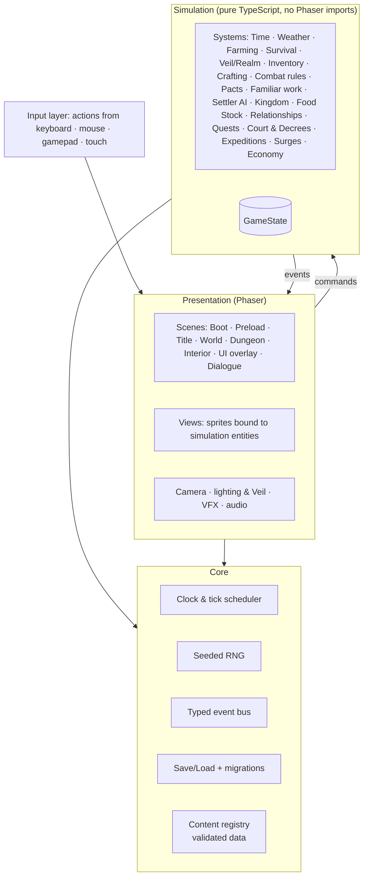

# 11 — Technical Design

> **TL;DR (v0.2):** **TypeScript + Phaser 4 + Vite**, web-first (every build is playable in a browser, including on your phone), wrapped with **Electron** for Steam. Characters animate with **Spine** (official Phaser 4 runtime). Maps in **Tiled**, dialogue in **Ink**, content as **validated data files**. The core rule: **simulation is separate from rendering**, so farming, economy, AI, and time can be unit-tested without drawing anything.
---

## 1. Engine decision

### 1.1 What an engine is (plain language)
A game engine is the **workshop** a game is built in: it draws the graphics, plays sounds, reads the keyboard or controller, and runs the game's rules every frame. Engines differ in four ways that matter to us:

1. **Editor or code?** Some give you a visual editor (drag objects into a scene); others are mostly code.
2. **Where can the game run?** PC, web browser, phone, consoles.
3. **Who can work in it?** Programmers only, or artists and designers too.
4. **Cost and licence.**

### 1.2 The options

| Engine | What it's like | Good at | Weak at | Cost |
|---|---|---|---|---|
| **Phaser 4 (TypeScript, web)** | A code library; the game runs in any web browser | Instant playable links (PC and phone); fits a code-first workflow; official **Spine** runtime for HD animation; ships to Steam through a desktop wrapper | No built-in scene editor (we use **Tiled**, a free visual map editor); consoles need a port later | Free |
| **Godot 4** | A full visual editor + its own scripting language | Very friendly all-round 2D engine; built-in animation and skeleton tools; exports to PC, mobile, web; console exports through partner companies | Sharing test builds from our cloud workflow is heavier; to work hands-on you'd install the editor | Free, open source |
| **Unity** | The industry-standard editor (C#) | Huge ecosystem; the most proven console path | Heavy for a 2D game; licensing controversy in 2023; can't be run in our workflow | Free tier, paid above a revenue threshold |
| **GameMaker** | A 2D-focused editor | Popular for 2D indie games | Proprietary editor; can't be run in our workflow | Paid tiers for commercial release |

### 1.3 Recommendation for **this** team (you + me, for now)

**Phaser 4, web-first.** Reasons, in order:
1. **I write the code and you review by playing.** With Phaser I can build, test in a real browser here, and send you a **link you open on your phone or PC**, with nothing to install. With the other engines you'd have to install tools to see progress.
2. **The art direction is supported.** HD illustrated art and **Spine** skeletal animation work in Phaser 4 through Esoteric Software's official runtime (`@esotericsoftware/spine-phaser-v4`, which targets Phaser ^4.2.1).
3. **Your artist and you still get a visual editor for maps:** Tiled lets anyone place trees, mushrooms, and props by hand, which is exactly how the reference look is built.
4. **Steam is covered** through an Electron desktop build (a proven path for web-built games: *CrossCode* was made with HTML5/JavaScript, and *Vampire Survivors* started in Phaser before a later Unity port for consoles).

**The honest trade-off:** if the game later needs consoles, or a hired team prefers Godot or Unity, the **code** would be rewritten, but the **content carries over**: art, Spine rigs, Tiled maps, Ink dialogue, JSON data, audio. We re-check this choice at the **Vertical Slice gate (Step 16)**.

**Second choice:** Godot 4, if you ever want to open the project and edit scenes yourself.

**Version:** Phaser **4.x** (npm `latest` was 4.2.1 when this doc was written). Exact versions are pinned and upgraded deliberately.

---

## 2. Tech stack

| Concern | Choice |
|---|---|
| Language | TypeScript (strict mode) |
| Engine | Phaser 4 (WebGL) |
| Character animation | **Spine** (editor licence for the animator) + official runtime `@esotericsoftware/spine-phaser-v4` |
| Build tool | Vite |
| Maps & dungeon room chunks | **Tiled** (`.tmx` source → `.tmj` runtime) |
| Dialogue & story scripting | **Ink** (compiled to JSON at build time, run with `inkjs`) |
| Content data | JSON/TS files validated with **zod** schemas at build and test time |
| Art pipeline | Layered PSD/Krita at 2× → export script → packed atlases (PNG + JSON), 1× default + 2× high-res pack; Spine projects → `.skel` + atlas |
| Audio | Phaser Web Audio sound manager; Ogg + AAC; audio sprites |
| Save storage | IndexedDB (web) · file system (desktop) |
| Unit tests | Vitest |
| Browser smoke tests | Playwright (Chromium) |
| Lint & format | ESLint + Prettier |
| CI | GitHub Actions |
| Desktop / Steam | **Electron** + a Steamworks bridge (achievements, cloud saves); Tauri evaluated as a lighter option |

---

## 3. Architecture



**Rules:**
1. **Simulation never imports Phaser.** It reads and writes `GameState` and emits events.
2. **Presentation never mutates state directly.** It sends commands (`TillTile`, `PlantSeed`, `AssignJob`…) that systems validate and apply.
3. **All randomness goes through the seeded RNG** (per-save seed + day + context), so bugs are reproducible and dungeon layouts are consistent for a day.
4. **All tunable numbers live in data files**, never hard-coded, so balance changes don't touch code.

---

## 4. Time & simulation model

| Loop | Rate | Handles |
|---|---|---|
| **Frame loop** | 60 FPS | Movement, collision, combat, animation, camera, VFX |
| **Game tick** | Every 10 in-game minutes (7 real seconds) | Needs, Exposure, familiar and settler schedules, production queues, weather changes |
| **Day rollover** | On sleep | Crop growth, spoilage, Food Stock consumption, tithe, arrivals, expedition results, dungeon re-seed, autosave |

- **Off-screen simulation is abstract:** settlers in another map don't walk around physically; their schedules resolve as time slices. Only the current map simulates movement.
- **AI updates are staggered** across frames (a fixed per-frame budget) so 90 residents never spike a frame.

---

## 5. Entities & AI

- **Entity records** (plain data in `GameState`: id, type, position, components) + **view objects** in scenes. A lightweight component approach, not a full ECS framework.

| Actor | AI approach |
|---|---|
| **Settlers** | Daily schedule (work, leisure, sleep) + **utility scoring** to pick jobs + A* on the tile grid, with path caching and flow fields for common destinations (Granary, Throne, Tavern) |
| **Familiars** | Work Posts publish tasks (water tile X, mine node Y); a state machine: Idle → Claim task → Travel → Work → Rest → Eat |
| **Enemies** | One small state machine per archetype (Chaser, Charger, Ranged, Caster, Tank, Swarm, Ambusher, Summoner, Support) with telegraph states |
| **Companions** | Follow → pick target (the player's target first) → use skill on cooldown; **Command Mode** orders override |

---

## 6. Maps & dungeon generation

**Tiled layer convention:** `Ground` · `Detail` · `Collision` · `Objects` (spawns, warps, interactables) · `Above` (canopies, roofs) · `Lights` · `Zones` (tillable, no-build, Realm-blocked).

**Dungeon generator (per floor):**
1. Seed = save seed + dungeon + floor + in-game date.
2. Pick a layout graph template (4–9 rooms, with branches).
3. Place room chunks whose **door sockets** match (N/E/S/W), weighted by floor type (§11 of the systems doc).
4. Validate: entrance → Descent reachable; keys placed before their locks.
5. Populate: enemies, ore, forage, and chests from the dungeon's spawn tables (by floor band).
6. Special floors (captives, memory shrines, Guardian) are hand-authored and inserted at fixed floors.

---

## 7. Data-driven content

Content lives in `src/data/`, one file per domain, validated at build time. The IDs match the design docs exactly.

```ts
// Sketch only; the real schemas are written in Step 5.
type Season = "spring" | "summer" | "autumn" | "winter";
type Element = "terra" | "aqua" | "ignis" | "zephyr" | "lumen" | "umbra";

interface CropDef {
  id: string;              // "crop_mandrake"
  seasons: Season[];       // ["spring"]
  daysToGrow: number;      // 8
  regrowDays?: number;     // absent = single harvest
  seedPrice: number;       // 90
  sellPrice: number;       // 180
  stages: number;          // growth sprite count
  rules?: CropRule[];      // e.g. { kind: "spawnCreature", creature: "cre_mandragling", chance: 0.05 }
}

interface CreatureDef {
  id: string;              // "cre_mossbun"
  element: Element;
  size: "S" | "M" | "L" | "BOSS";
  pact: PactMethod[];      // [{ kind: "offering", item: "crop_carrot" }]
  work: Partial<Record<WorkSkill, 1 | 2 | 3>>;
  yield?: { item: string; everyDays: number };
  trueAscension?: { into: string; catalyst: string };
}

interface SwornDef {
  id: string;              // "npc_linnea"
  building: string;        // "bld_clinic"
  romanceable: boolean;
  birthday: { season: Season; day: number };
  values: [Value, Value];
  gifts: { loved: string[]; liked: string[]; disliked: string[] };
  knightPerk: string;
  consortPerk?: string;
}
```

**Localisation-ready from day one:** every player-facing string lives in `locales/en.json`, keyed by ID (`item.crop_turnip.name`, `npc.linnea.bio`). The game ships in English; adding Bahasa Indonesia later means adding `locales/id.json`.

---

## 8. Dialogue (Ink)

- Stories in `src/dialogue/*.ink`, compiled to JSON at build time.
- Ink variables are **bound to GameState** (hearts, flags, Kingdom Rank, spared/banished choices).
- **Tags drive presentation:** `# portrait: linnea_blush`, `# emote: heart`, `# sfx: door_open`, `# camera: shake`.
- Heart events, recruit quests, Court Day petitions, and Flicker commentary are all Ink.

---

## 9. Save system

| Rule | Detail |
|---|---|
| Format | JSON snapshot of `GameState` + a `version` number |
| Migrations | Ordered migration functions (v1 → v2 → …); every EA update ships its migration and a test using **golden save files** |
| When | Autosave on sleep; one-time **suspend save** on quit (deleted on load) |
| Slots | 3 slots, each keeping backups of the last 3 in-game days |
| Integrity | Checksum to detect corruption, then fall back to the latest backup (not anti-cheat) |
| Storage | IndexedDB (web) · files in the user data folder (desktop) · Steam Cloud (desktop) |

---

## 10. Rendering, lighting & the Veil

- **HD illustrated rendering:** smooth (linear) texture filtering with mipmaps; the camera scales the 1920×1080 reference to any window size.
- **Texture sets:** 1× atlases by default (web, laptops), a 2× high-res pack on capable desktops; later, GPU-compressed textures to cut memory.
- **Per-region streaming:** only the current region's terrain, props, and creatures are loaded.
- **Spine rigs** for characters and larger creatures; skins for customization; tint and gradient-map shaders for colour variants.
- **Night and the Veil:** a full-screen **darkness/fog render texture** is drawn above the world, and light sources **erase** soft circles out of it every frame. The Realm border, lanterns, and Flicker cut glowing holes into the Veil, which is exactly the look in the art direction.
- Time-of-day grading via tint and saturation, per the art direction.
- **The Hollowed shader** (desaturate + rim light + white eyes) is one reusable effect.
- Depth sorting by the Y coordinate of each object's ground pivot.

---

## 11. Performance budgets

| Budget | Target |
|---|---|
| Frame rate | 60 FPS at 1080p on a mid-range integrated-GPU laptop |
| Draw calls | < 200 per frame |
| Active sprites | < 2,000 on screen |
| Settler and familiar AI | < 2 ms per frame (staggered) |
| Pathfinding | < 1 ms per frame (queued) |
| Memory | < 1 GB total; texture budget per region ≤ ~350 MB (1× set) |
| Spine | ≤ 40 animated rigs on screen at full update rate; distant rigs update at reduced rate |
| Region load | < 5 s |

Profile from Step 6 onward, with a stress-test scene (90 residents + 40 familiars) by Step 10.

---

## 12. Project structure (planned for Step 5)

```
NOZE/
├── docs/                    Design Bible (this folder)
├── art_src/  audio_src/     Layered source art, Spine projects, audio (Git LFS)
├── game/
│   ├── public/assets/       Exported atlases, maps, audio, fonts
│   ├── src/
│   │   ├── core/            clock, rng, events, save, registry
│   │   ├── systems/         farming, survival, veil, combat, pacts, kingdom, ai, …
│   │   ├── data/            content definitions + zod schemas
│   │   ├── dialogue/        .ink sources
│   │   ├── scenes/          Phaser scenes
│   │   ├── views/           entity views, VFX
│   │   ├── ui/              HUD, menus, widgets
│   │   ├── input/           action map, rebinding
│   │   └── main.ts
│   ├── locales/en.json
│   └── tests/               unit (Vitest) + smoke (Playwright)
├── tools/                   asset export, content validator, string extractor, balance sims
└── .github/workflows/       CI
```

---

## 13. Coding standards

- TypeScript `strict`; no `any` in systems code.
- **Naming:** `PascalCase` classes and types, `camelCase` functions and variables, `snake_case` content IDs (matching the docs).
- **Systems are pure and testable:** input = state + command, output = new state + events.
- **Typed events** (a discriminated union), no stringly-typed event names.
- Small files; one system per folder; public API through an `index.ts`.

---

## 14. Testing

| Layer | What | Tool |
|---|---|---|
| Unit | Crop growth, quality rolls, Pact formula, needs and happiness, Food Stock consumption, tithe, decrees, relationship points | Vitest |
| Generators | Dungeon floors always reachable, for 10,000 random seeds | Vitest (property tests) |
| Save migrations | Golden save files from each release load correctly | Vitest |
| Balance | Headless simulation of 28-day seasons with scripted players, reporting gold, food, and happiness curves | Node scripts |
| Smoke | Boot → title → new game → walk → sleep → load, with no console errors | Playwright (Chromium) |

---

## 15. CI/CD

1. **On every push:** install → lint → typecheck → unit tests → build → Playwright smoke test.
2. **Playable web build** uploaded as an artifact and published for review, so **you can play each step from a link**.
3. **On release tags:** desktop builds (Windows / macOS / Linux) via Electron, then the Steam upload (from Step 21).

---

## 16. Developer tools (built early; they pay for themselves)

- **Debug overlay:** FPS, tick, entity counts, the Realm radius, collision view, AI paths.
- **Dev console:** give item, set time, skip day, spawn creature, set hearts, set rank, teleport.
- **Time controls:** pause, ×1, ×10, ×100 for simulation testing.
- **Content hot reload** in dev builds (edit a JSON file, see it live).
- **Asset export script:** layered sources → trimmed PNGs → packed atlases (1× and 2×), with name validation against the asset list.

---

## 17. Technical risks

| Risk | Mitigation |
|---|---|
| Phaser 4 maturity (newer than Phaser 3) | Pin versions; smoke tests; isolate engine calls in the presentation layer so a Phaser 3.x fallback is contained |
| Many residents hurting performance | Abstract off-screen simulation; staggered AI; flow fields; a stress test by Step 10 |
| Save corruption across EA updates | Versioned migrations, golden-file tests, rolling backups |
| Browser audio quirks | Unlock on first input; Ogg + AAC fallback |
| Steam features in a web wrapper | Electron + a proven Steamworks bridge; test the overlay and achievements early (Step 21) |
| HD texture memory in browsers | 1× default set, per-region streaming, compressed textures, budgets checked in CI |
