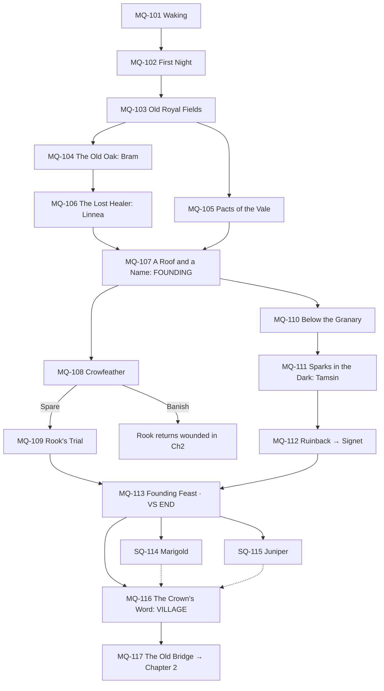

# 14 — Narrative & Progression Design

> **TL;DR:** How every NPC connects **story → systems → progression**. This doc holds the master quest chain for all six chapters, the **NPC Purpose Matrix** (what each character means, unlocks, requires, and gates), the interaction model (verbs, schedules, dialogue tiers, reactivity), **heart-event arcs for all 24 Sworn**, the **Knowledge & Secrets Matrix** that controls the mystery, ready-to-use in-world lore texts, and a **flag-level breakdown of Chapter 1**, which the playable narrative prototype (Step 4) will implement.
>
> ⚠️ **Spoilers:** contains the full mystery.

---

## 1. Narrative design principles

1. **Every NPC earns their place three times:** a **story role** (what they mean), a **system role** (what they unlock or do), and a **progression role** (when they appear and what they gate). A character missing one of these gets merged or cut.
2. **The theme is a mechanic.** "A crown is held up by many hands" is literal: the true ending counts your people, their Loyalty, and your Knights.
3. **Reactivity over branching.** Few big branches (Spare/Banish, the endings); many small reactions (NPCs remember what you did).
4. **No permanently missable Sworn.** A choice changes **how** someone joins, never **whether** they can. (Suikoden's missable Stars frustrated players; cozy players hate lockouts.)
5. **Each chapter answers one question and asks a new one** (see §7).
6. **Cozy pacing:** story beats never create tight deadlines. Scheduled events (festivals, Surges) are announced days ahead.
7. **Voice before plot:** each Sworn should be recognisable from a single line (see the voice samples in §5.6).
8. **Lore is found, not told.** The past is scattered through the world (ruins, inscriptions, letters, Memory Fragments, NPC memories) for players to piece together. Cutscenes are for present-day drama.
9. **Deeper hearts never mean more distance.** Heart events can land hard truths, but every relationship ends closer than it started. (Lesson from the Kael discussion: a max-heart ending that pushes a character away feels like a punishment.)
10. **Hearts give access.** Relationships unlock story, secret places, and rare-material quests, not just affection (§5.8).

---

## 2. The three layers, with one example

| Layer | Question it answers | Example: **Rook** |
|---|---|---|
| **Story** | What does this person *mean* in the theme? | Mercy and belonging: the enemy who becomes family |
| **System** | What do they *unlock or do*? | Scout's Post: map reveal, bounty board, later **Expeditions** |
| **Progression** | When do they appear? What do they require? What do they gate? | Ch1, days 7–9; needs Hamlet rank; gates Expeditions (Village rank) and 4 of the 5 Sworn needed for Village |
| **Relationship** | What's their personal arc? | From outlaw to royal scout, and maybe to Consort |

---

## 3. Master quest chain

### 3.1 Chapter overview

```mermaid
flowchart LR
    P[Prologue<br/>The Last Decree] --> C1[Ch1 Ashes & Embers<br/>Signet · Hamlet→Village]
    C1 -->|Old Bridge + Waybeacon| C2[Ch2 Whispers in the Wood<br/>Scepter · Town]
    C2 -->|Cliff Road Waybeacon| C3[Ch3 The Drowned Bells<br/>Orb · reveal: this is Halcyon]
    C3 -->|Sol's ship or mountain pass| C4[Ch4 Forge of the Mountain<br/>Sunblade · City]
    C4 -->|Sunblade cuts Frost Thorns| C5[Ch5 Where Stars Fall<br/>Mantle · Kingdom · reveal: I made the Veil]
    C5 -->|Mantle + Kingdom rank| C6[Ch6 The Hollow Crown<br/>Crown · endings]
```

### 3.2 All main quests

**MP** = main path (required) · **OPT** = optional Sworn recruit (side quest; counts toward rank requirements).

| ID | Quest | Chapter | Key NPCs | Unlocks | Type |
|---|---|---|---|---|---|
| MQ-P | The Last Decree | Prologue | Lucan, Vesper | Combat tutorial (full power) | MP |
| MQ-101 | Waking at the Ashen Throne | 1 | Flicker | Movement, gathering, crafting, campfire | MP |
| MQ-102 | The First Night | 1 | Flicker | Beacon T1, Exposure, the Veil | MP |
| MQ-103 | Old Royal Fields | 1 | Flicker, Mira | Farming, Trade Crate, caravan | MP |
| MQ-104 | The Old Oak | 1 | **Bram** | Carpenter's Lodge, construction | MP |
| MQ-105 | Pacts of the Vale | 1 | Flicker | Pacts (Offering, Subdue), familiar work | MP |
| MQ-106 | The Lost Healer | 1 | **Linnea** | Herbalist Hut, knockout recovery | MP |
| MQ-107 | A Roof and a Name | 1 | Bram, Linnea, Hob | Longhouse, **the Founding**, Hamlet rank, settlers | MP |
| MQ-108 | Crowfeather | 1 | **Rook**, Magpie, Jackdaw, Finch | Duel, **Spare / Banish** | MP |
| MQ-109 | Rook's Trial | 1 | Rook | Food Stock, Commons; Scout's Post | MP |
| MQ-110 | Below the Granary | 1 | Flicker | Restoration Projects; Sunken Cellars | MP |
| MQ-111 | Sparks in the Dark | 1 | **Tamsin** | Smithy, tool upgrades | MP |
| MQ-112 | The Shell That Holds a Tower | 1 | Ruinback | **Signet**, Purify, Naming | MP |
| MQ-113 | The Founding Feast | 1 | Everyone | Cliffhanger: the Pale Choir's hymn (**VS end**) | MP |
| SQ-114 | Hearth and Home | 1 | **Marigold**, Pip | Tavern | OPT |
| SQ-115 | The Scattered Herd | 1 | **Juniper** | Den upgrades → Sanctuary | OPT |
| MQ-116 | The Crown's Word | 1 | Settlers | Village rank: **Court Day**, **Decrees**, Tithe, Expeditions | MP |
| MQ-117 | The Old Bridge | 1 | Bram | Waybeacon + Restoration → **Chapter 2** | MP |
| MQ-201 | Into Whisperwood | 2 | Flicker | Region 2 | MP |
| SQ-202 | Three Pranks | 2 | **Fen** | Grove Nursery | OPT |
| MQ-203 | The Lantern Keeper | 2 | **Aldous** | Chapel of Dawn, the prophecy | MP |
| MQ-204 | The Sealed Library | 2 | **Elowen** | Royal Archive, research | MP |
| MQ-205 | The Unsung | 2 | **Nix**, Linnea | Enchanter's Spire | MP |
| MQ-206 | Gloom | 2 | Aldous, Seren (later) | Happiness crisis; festivals and Chapel as counters | MP |
| SQ-207 | A Merchant's Wager | 2 | **Mira** | Market | OPT |
| MQ-208 | Mother of Rot | 2 | Mother Mycel | **Scepter**, Command Mode | MP |
| MQ-209 | Town Charter | 2 | Bram | Stone Keep, Town rank | MP |
| SQ-210 | The Iron Remembers | 2 | **Kael** | Great Forge: Veilforging | OPT |
| MQ-301 | Salt and Glass | 3 | Flicker | Region 3 | MP |
| SQ-302 | The Glassback Carp | 3 | **Orin** | Fishery, fishing | OPT |
| SQ-303 | A Duel of Verses | 3 | **Seren** | Bandstand | OPT |
| SQ-304 | Scattered Cogs | 3 | **Pim & Pom** | Workshop, automation | OPT |
| MQ-305 | The Gull's Gamble | 3 | **Sol** | Harbor, trade routes, sea route to Ch4 | MP |
| MQ-306 | Sails on the Horizon | 3 | Ingrid, Thane | The Dominion arrives | MP |
| MQ-307 | The Royal Seal | 3 | Elowen | **Reveal: this is Halcyon** | MP |
| MQ-308 | The Bell That Drowned | 3 | Tidetoll | **Orb**, Beacon T3 | MP |
| MQ-401 | The Mountain Pass | 4 | Sol | Region 4 | MP |
| SQ-403 | Three Duels | 4 | **Akane** | Arena | OPT |
| SQ-404 | The Sleepless Scholar | 4 | **Hollis** | Alchemist Lab | OPT |
| SQ-405 | Barrels and Hot Springs | 4 | **Hilde** | Brewery, Bathhouse | OPT |
| MQ-406 | Siege at Dawn | 4 | **Ingrid**, Thane | Boss, **Spare / Banish** | MP |
| MQ-407 | The Iron Rose Turns | 4 | Ingrid | Barracks | MP |
| MQ-408 | The Forge Wyrm | 4 | Vulkarn | **Sunblade** | MP |
| MQ-409 | City of Lights | 4 | Bram | Castle, City rank | MP |
| SQ-410 | The Sword That Never Breaks | 4 | Kael | Kael remembers everything (needs the Sunblade) | OPT |
| MQ-501 | Through the Frost Thorns | 5 | Flicker | Region 5 | MP |
| SQ-502 | The Silent Fang | 5 | **Tor** | Hunter's Lodge, mounts | OPT |
| MQ-503 | A Star-Reader's Pilgrimage | 5 | **Saga** | Observatory | MP |
| SQ-504 | The Frozen Manor | 5 | **Isolde** | Tailor's House | OPT |
| MQ-505 | The Long Winter | 5 | Everyone | 14-day extreme winter event | MP |
| MQ-506 | What I Decreed | 5 | Vesper, Flicker | **Reveal: you made the Veil** | MP |
| MQ-507 | The Star-Eyed | 5 | Astraea | **Mantle** | MP |
| MQ-508 | Coronation | 5 | Everyone | Palace, **Kingdom rank**, Coronation Festival | MP |
| MQ-601 | Into the Hollow Crown | 6 | Flicker | Region 6 | MP |
| SQ-602 | Old Letters | 6 | — | Lucan's backstory (6 letters) | OPT |
| MQ-603 | Halcyon Below | 6 | — | The final dungeon | MP |
| MQ-604 | The Ashen Warden | 6 | **Lucan** | Purify → Hall of Knights | MP |
| MQ-605 | The Last Decree, Again | 6 | Flicker, Elowen | The final choice | MP |
| MQ-606 | The Maw Below | 6 | Your whole realm | **Endings** | MP |

**Main-path Sworn (11):** Bram, Linnea, Rook, Tamsin, Aldous, Elowen, Nix, Sol, Ingrid, Saga, Lucan.
**Optional Sworn (13):** Juniper, Marigold, Fen, Mira, Kael, Orin, Seren, Pim & Pom, Akane, Hollis, Hilde, Tor, Isolde.

Rank requirements ask for a **count** of Sworn, not specific ones, so players choose which optional Sworn to pursue: Village needs 1 optional (5 total), Town 2 (9), City 6 (15), Kingdom 10 (20).

### 3.3 Pacing targets

| Stretch | Typical in-game window | Cumulative real time | Rank at end | Sworn at end |
|---|---|---|---|---|
| Prologue + Ch1 part 1 (**VS**) | Year 1, Spring 1–14 | ~3–4 h | Hamlet | 4 (+ Mira visiting) |
| Ch1 complete | Y1 Spring 15 – Summer 14 | ~10 h | Village | 6 |
| Ch2 | Y1 Summer – Autumn | ~20 h | Town | 12 |
| Ch3 | Y1 Autumn – Winter | ~30 h | Town | 16 |
| Ch4 | Y2 Spring – Summer | ~42 h | City | 20 |
| Ch5 | Y2 Autumn – Winter (the Long Winter) | ~54 h | Kingdom | 23 |
| Ch6 | Y3 Spring | ~60 h | Kingdom | 24 |

Seasons don't wait for the story: winter comes when it comes. The first winter is a **seasonal event** (the Food Stock test) that hits whatever chapter you're in.

---

## 4. NPC Purpose Matrix

| Sworn | Story role (theme) | System role (unlocks) | Joins | Requires | Gates / enables | Path |
|---|---|---|---|---|---|---|
| **Bram** | The past that gave up waiting; learning to build for a future | Carpenter's Lodge: construction and every building upgrade | MQ-104, Ch1 day 3 | — | Everything built; the Founding | MP |
| **Linnea** | Mercy and healing; guilt turned into care | Clinic: knockout recovery, injuries, Veil-rot, potions | MQ-106, day 5 | Survived night 1 | Knockout safety net; **curing Nix** (MQ-205) | MP |
| **Rook** | The spared enemy who becomes family | Scout's Post: map, bounties, **Expeditions** | MQ-108/109, days 7–9 | Hamlet | Expeditions; bandit trio as settlers | MP |
| **Tamsin** | Finding your own voice | Smithy: tool and weapon tiers 1–3, smelting | MQ-111, Cellars F3 | Cellars open | Tool progression; apprentice arc with Kael | MP |
| **Juniper** | Loving again after loss | Den → Sanctuary: Bond, eggs, hatching | SQ-115 | Den T1 | Sanctuary; Beast Fair | OPT |
| **Marigold** | Community is food shared | Tavern: meals, recipes, the arrivals board | SQ-114 | Hamlet | Better settler Joy; recipe unlocks | OPT |
| **Elowen** | Memory; the one who waited a thousand years | Royal Archive: collections, research, Memory Fragments | MQ-204 | Rootdeep F5 | Research tree; **the Halcyon reveal** (MQ-307) | MP |
| **Fen** | Nature's trust in crowns must be earned | Grove Nursery: trees, rare seeds, Veil Seeds | SQ-202 | Whisperwood | Fruit trees; Veil Seed farming | OPT |
| **Mira** | Freedom vs. belonging: a spy who chooses a home | Market: shop, stalls, trade | SQ-207 | Village + Market plot | Market economy; double-agent bonus in the Ch4 siege | OPT |
| **Aldous** | Faith, and forgiveness for the faithful | Chapel: blessings, cleansing, festivals, **weddings** | MQ-203 | Whisperwood | Marriage; counters Gloom (MQ-206) | MP |
| **Nix** | Choosing your own name; redemption | Enchanter's Spire: Sigils, enchanting | MQ-205 | Clinic (Linnea) | Better Pact odds; Vesper's inner circle intel | MP |
| **Kael** | Being valued as a person, not a tool; the cost of the Sovereign's old orders | Great Forge: **Veilforging**, masterwork gear; later tiers 4–5 and the Sunblade line | SQ-210 | Whisperwood + Iron Ore | Veil-resistant gear; Tamsin's growth; the Sunblade memory (SQ-410) | OPT |
| **Sol** | Freedom and the fear of anchors | Harbor: trade routes, sea expeditions | MQ-305 | Saltglass | **Sea route to Ch4** | MP |
| **Orin** | Old promises between peoples | Fishery: rods, bait, Tide Traps | SQ-302 | Saltglass | Fishing progression; Tidekin lore | OPT |
| **Seren** | Songs keep a kingdom's memory | Bandstand: morale, festival bonuses | SQ-303 | Saltglass | **Rediscovers the Halcyon Anthem** (his 10♥) | OPT |
| **Pim & Pom** | Progress, and caring for family | Workshop: automation | SQ-304 | Saltglass | Dew Totems, Hauler Posts | OPT |
| **Akane** | Honour, and losing well | Arena: sparring, challenges | SQ-403 | Cinderpeak | Combat challenges; Sun Tourney venue | OPT |
| **Hollis** | Science with a conscience | Alchemist Lab: potions, Veil tonics | SQ-404 | Cinderpeak | The Hollowing-cure research line | OPT |
| **Hilde** | Joy as a way of mourning | Brewery (+ Bathhouse) | SQ-405 | Cinderpeak | Premium artisan goods | OPT |
| **Ingrid** | Loyalty to people over empires | Barracks: guards, Surge defense | MQ-406/407 | Ch4 climax | Defense; the Dominion peace thread | MP |
| **Saga** | Seeing the truth before it's spoken | Observatory: forecasts, luck | MQ-503 | Frostveil | **Leads to the truth** (MQ-506) | MP |
| **Tor** | Grief, and finding a new pack | Hunter's Lodge: bounties, **mounts** | SQ-502 | Frostveil | Mounts; Alpha bounties | OPT |
| **Isolde** | Dignity rebuilt from exile | Tailor's House: clothing, **heraldry editor** | SQ-504 | Frostveil | Coronation outfit; full banner editor | OPT |
| **Lucan** | The oath that outlasted the kingdom | Hall of Knights: Knight Order upgrades | MQ-604 | All Regalia + Loyalty | Required for the true ending's best outcome | MP |

### Key non-Sworn NPCs

| NPC | Story role | System role | Appears |
|---|---|---|---|
| **Flicker** | Your conscience and your hidden memory | Tutorials, hints, commentary; Purify, Command, Beacon upgrades | Always |
| **Hob Furrow** | Proof that ordinary people will follow you | First settler; completes Hamlet requirements | MQ-107 |
| **Magpie, Jackdaw, Finch** | Rook's found family | Named settlers (only if Rook is spared in Ch1) | MQ-109 |
| **Pip** | The future the kingdom is for | Befriends familiars; kid's-eye commentary | SQ-114 |
| **Humphrey** | Comic relief | Mira's pack-beast; caravan mascot | MQ-103 |
| **Vesper** | Grief turned to nihilism; Elowen's shadow | Pale Choir antagonist; Ch5 boss | Prologue, Ch2–6 |
| **Lord-Marshal Thane** | Pragmatism without mercy | Dominion antagonist; treaty or defeat | Ch3–4 |

---

## 5. NPC interaction design

### 5.1 Interaction verbs

| Verb | Available with | What it does |
|---|---|---|
| **Talk** | Everyone | Daily hearts (+20), context lines, rumours, hints |
| **Gift** | Sworn, settlers | Hearts (2 per week per person; birthday ×5) |
| **Ask** | Sworn | Personal requests (item or task) → hearts, recipes, unique rewards |
| **Invite** | Companion Sworn · dating partner | Join the party for a dive · dates · festival partner |
| **Assign** | Settlers, familiars | Jobs and work posts (Sworn run their own building) |
| **Judge** | Petitioners | Court Day rulings (Village rank+) |
| **Knight** | Sworn (Hearts ≥ 6, Loyalty ≥ 80) | Knighthood ceremony → Knight perk |
| **Propose** | Dating partner (10♥) | Royal Wedding → Consort |
| **Spare / Banish** | Defeated human enemies | Branches how they join (never *whether*) |

### 5.2 Schedules
Every Sworn has a weekly schedule with variants for **rain**, **festivals**, **Court Day**, and **their birthday**. Template, using Linnea:

| Time | Normal day | Rain | Court Day (Sun) |
|---|---|---|---|
| 06:00–08:00 | Gathering herbs by the river | Sorting herbs at the Clinic | Gathering herbs |
| 08:00–17:00 | Clinic (open) | Clinic (open) | Court 09–12, then Clinic |
| 17:00–20:00 | Tavern (with Marigold) or the Ruined Chapel | Clinic, reading | Tavern |
| 20:00–23:00 | Home (Clinic quarters) | Home | Home |

### 5.3 Dialogue tiers

| Tier | Hearts | Tone |
|---|---|---|
| Stranger | 0–1 | Guarded, functional, sometimes funny |
| Acquaintance | 2–4 | Small talk, opinions, hints of backstory |
| Friend | 5–7 | Personal stories, teasing, asks for help |
| Close / Dating | 8–9 | Vulnerable, flirty (romanceables), protective |
| Beloved / Sworn-kin | 10 | Warm, candid, references shared history |

Each Sworn gets ~6 generic lines per tier, plus contextual pools.

### 5.4 Which line plays (priority order)
1. **Story-critical** (active quest)
2. **Reaction to a recent deed** (§5.5)
3. Festival / birthday
4. Season / weather
5. Location
6. Tier-generic

### 5.5 Remembered deeds (reactivity flags)
NPCs react for a few days after these events, and some remember forever:

| Deed flag | Who reacts | Example |
|---|---|---|
| `deed.spared_rook` / `deed.banished_rook` | Everyone in Ch1–2 | Bram: *"Letting a thief into the pantry. Bold. Stupid, maybe. Bold."* |
| `deed.saved_linnea_on_birthday` | Linnea (forever) | Linnea mentions it every Spring 5 |
| `deed.named_familiar` | Juniper, Flicker | Juniper insists on meeting the newly named friend |
| `deed.knocked_out_yesterday` | Linnea, companions | Worried lines; Linnea lectures you |
| `deed.gave_hated_gift` | That NPC | Cold lines for 2 days |
| `deed.rank_up` | Everyone | Celebration lines |
| `deed.decree_<id>` | Sworn whose values it touches | Approval or protest lines |
| `deed.married_<id>` / `deed.knighted_<id>` | Everyone | Congratulations; teasing |
| `deed.spared_<boss>` / `deed.banished_<boss>` | Relevant factions | Changes how rivals speak about you |

### 5.6 Voice samples (one line each, English)

| Sworn | Sample line |
|---|---|
| Bram | "Measure twice, cut once, complain forever. That's carpentry, kid." |
| Linnea | "Chamomile for sleep, yarrow for cuts… and for kings who don't rest, a stern talking-to." |
| Rook | "Relax, Your Royal Muddiness. If I wanted your stuff, you'd already be missing it." |
| Tamsin | "I-it's not a sword yet. It's… it's a *promise* of a sword." |
| Juniper | "Everyone, this is the Sovereign! Say hi! …Okay, they're shy. Mostly the ones with teeth." |
| Marigold | "Sit. Eat. Then you can go save the world, sweetheart." |
| Elowen | "You're holding the book upside down. *Honestly.* Some things never change." |
| Fen | "A crown and a seed walk into a wood; only one of them will come out good!" |
| Mira | "For you? Special price. It's the regular price, but I say it warmly." |
| Aldous | "Ha! The light always returns. Usually around six in the morning." |
| Nix | "This spell is called *Umbral Sorrowlance*. Laugh and it's called *Umbral Sorrowlance: Second Strike*." |
| Sol | "Rules are just suggestions written by people who never met a storm." |
| Orin | "The tide doesn't hurry. Neither does the fish. Neither should you." |
| Seren | "Your Majesty, your boots are a tragedy in three acts. I adore them." |
| Pim & Pom | Pim: "It's perfectly safe!" · Pom: "It is *not* perfectly safe." |
| Kael | "Iron remembers everything you do to it. So do people." |
| Akane | "Bet you can't beat me to the river. Bet you can't beat me at *anything*." |
| Hollis | "Sleep is theoretically important but practically I have a hypothesis about that." |
| Hilde | "Water? Water's for fish, dear. Have an ale." |
| Ingrid | "Your guards patrol like ducks. Earnest ducks. We'll fix it." |
| Saga | "You'll trip on the third step today. …Oh. Already?" |
| Tor | "…Cold. Here." *(hands you his scarf)* |
| Isolde | "Darling, a monarch in mud-brown is a *political statement*, and not a good one." |
| Lucan | "Forgive me, my liege. I have been standing a very long time." |

### 5.7 NPC-to-NPC life
- **Ambient banter pairs** from the cast relationship map ([04 §7](04_CHARACTERS.md#7-cast-relationship-map-drives-group-heart-events)): e.g. Elowen ↔ Seren bicker at the Bandstand; Tamsin ↔ Kael argue over technique at the forge; Sol ↔ Ingrid rivalry at the docks.
- **Group events** at thresholds (e.g. when both Tamsin and Kael reach 6♥: "The Masterwork Contest").
- **Personal petitions** at Court Day open heart events (see [07 §7](07_BUILDINGS_AND_KINGDOM.md#7-court-day-petition-templates)).

### 5.8 Hearts give access

Relationships open doors, not just affection:

| Hearts | Unlocks | Example (Rook) |
|---|---|---|
| 3♥ | First personal request (Ask) | Find Magpie's lost slingshot |
| 5♥ | Their **secret place**, marked on your map | Rook's stargazing lookout |
| 7♥ | A **rare-material quest** | A smuggler's cache full of Veilglass |
| 9♥ | A **signature recipe or item** | The Crowfeather Charm trinket |

**Small quests along the way:** every Sworn has 3–4 Ask requests between heart events, each with a small reward (a recipe, a rare material, or just a good conversation), so the road to 10♥ pays off at every step. Some Sworn also shift their faction's **Standing** ([03 §15.5](03_GAMEPLAY_SYSTEMS.md#155-faction-standing)).

---

## 6. Heart-event arcs (all 24 Sworn)

For romance options, **8♥** is the first date and **10♥** the confession (proposal-ready). For others, 10♥ is a lifelong-bond moment. The **Knight vow** plays at knighting.

| Sworn | 2♥ | 4♥ | 6♥ | 8♥ | 10♥ | Knight vow |
|---|---|---|---|---|---|---|
| **Bram** | Shows you his model of the expedition ship that never came back | A storm tears the Lodge roof; you fix it together at night while he talks about his lost crew | Asks for help writing a letter to the daughter he left in the Outer Realms | Mira's caravan brings her reply: she's alive. Stay or go? | Carves a bench beside the throne: "For the kid who became a king." He stays | "I'll build walls for you. Not to keep people out. To keep them home." |
| **Linnea** ♥ | Teaches you a healing herb and its poisonous twin | At dusk, praying at the chapel for the village she lost | Refuses to let you kill a Hollowed fawn and shows you purification can heal | Night herb-gathering date under Glimmoth light | "I wanted to save everyone. Now I just want to stay with you." | "I'll mend whatever the Veil breaks." |
| **Rook** ♥ | His secret lookout where the gang watched stars | Steals medicine for a sick Magpie; you judge him | His village was abandoned by the same Dominion expedition Bram served | Rooftop date; gives you his crow feather "for luck" | "I never kneel. But for you, I'll stand guard." | Refuses to kneel, then kneels: "Don't make it a habit." |
| **Tamsin** ♥ | Stammers through presenting her first real sword | You catch her sewing a plush Mossbun; you swear secrecy | A letter from her old master mocks her; she forges all night and you stay | Forges you a small band "for practice," blushing | "When I'm with you I don't stammer. I think it's because I'm not scared." | "Every blade I make will know your name." |
| **Juniper** | Introduces all 14 of her Mossbuns by name | A familiar goes missing in the Veil at night; search together | Her childhood herd was lost to the Hollowing | Enters the Beast Fair for the first time | Braids a collar "for whatever friend you make next" | "Every creature here has a friend. That's me. And you." |
| **Marigold** | Brutally honest recipe taste test | Pip runs into the Veil looking for you; rescue | Her husband's death anniversary; you sit with her after closing | Teaches you his secret stew | Names a dish after you: "mostly potatoes, like you when you arrived" | "No one in this kingdom goes to bed hungry. Not while I breathe." |
| **Elowen** ♥ | Corrects how you sit "as a sovereign should" (suspicious) | A restored mural shows someone who looks like you; she deflects | *(after MQ-307)* Admits she served your past self and waited a thousand years | A date under the Archive's star dome; she reads you a letter written a millennium ago | "I waited a thousand years for my Sovereign. I'd wait another for you. Don't make me." | "The Archive remembers everything. I'll make sure it remembers you kindly." |
| **Fen** | A riddle duel | Plants a sapling where a Veil Tree fell: a lesson in taking and giving | Shows you the grove where the Heartflame was first kindled | Asks you to promise the kingdom will never burn the Whisperwood | Names a tree after you: "It'll outlive us both. That's the point." | Sworn in rhyme |
| **Mira** | Shows you her ledger of "debts the Veil owes me" | The caravan is ambushed; Humphrey is hurt | **The confession:** she's been selling maps of your realm to the Dominion to pay a guild debt. Forgive (double agent) or expel (she returns before the Ch4 siege) | Invests her savings in your Market: "a bet on you" | Burns her guild contract: "Home is where your stock doesn't spoil." | "I'll keep your coffers full and your merchants honest. Mostly." |
| **Aldous** | Terrible puns until you laugh | Shows you the Lantern Order's prophecy scroll | Confesses he burned a village as a Dominion soldier | Asks you to judge him at Court: forgiveness or penance | Lights a new lantern "for the first dawn I've earned" | "Where your light can't reach, I'll carry a lantern." |
| **Nix** ♥ | Names a spell and dares you to laugh | Their Veil-mark flares; Linnea and you calm them | Vesper raised them after their village fell, and they still love her | Stargazing on the Spire roof; wonders what their real name was | "Nix means nothing. I chose it because I felt like nothing. It's the only thing I won't change, because you say it." | Keeps the name "Nix": "It's mine now." |
| **Kael** | A forging lesson: "Iron remembers everything you do to it." | Shadows attack his forge at night, hunting "something stuck"; you defend it together | *(after MQ-307)* Behind the forge's old Halcyon wall: a broken-crown carving and the shard of a sword he once made you | At Varric's grave in the Smiths' Rest, he remembers being the Blacksmith of the Crown | *(after SQ-410)* **The question:** "In this life, will you choose for me to live, or will you only need me to die again?" Both answers keep him close (§6.1) | "Last time I died keeping my word. This time I'll live keeping it." |
| **Sol** ♥ | Arm-wrestling at the docks | Sings a shanty about her parents' ship | A storm at sea; she admits she's afraid of being tied down | Sunset sail; she lets you steer | "I've one rule: never drop anchor. For you, I'll break it." | "Wherever the tide goes, your banner goes with it." |
| **Orin** | Teaches you to read the tide | Tells of the old Tidekin pact with Halcyon | Shows you the wreck of Sol's parents' ship | Gives you his old rod | Names you "Tide-friend" in the old tongue | "The sea keeps its promises. So will I." |
| **Seren** ♥ | A limerick about your muddy boots | Pretends not to care when Elowen savages his ballad | His mother's lute snaps; you gather materials to fix it | Plays a song about you and forgets to be charming | "Every song I wrote was about someone I lost. This is the first about someone I found." **Unlocks the Halcyon Anthem motif in the town theme** | Sings the anthem's first verse |
| **Pim & Pom** | Demonstration of the "Automated Turnip Butler" (it explodes) | The twins fight; you mediate | Their family workshop was seized by the Dominion | They build you a clockwork Flicker; the real Flicker is jealous | Name their best invention after you | Pim: "We'll build you a kingdom that runs itself!" Pom: "Safely." |
| **Akane** ♥ | Challenges you to a race | Loses a spar to Ingrid and sulks | Her clan exiled her for losing to a human: you | Moonlit sparring date; she might let you win | "You're the only one I want to keep losing to." | "Point me at your enemies. I'll handle the rest." |
| **Hollis** ♥ | Falls asleep mid-sentence; you cover him with a blanket | A lab accident you help contain | His Hollowing-cure research (links to Linnea and Nix) | A potion date that accidentally changes your hair colour | "I've calculated every variable. You're the one I can't predict. I like that." | "I'll never make a weapon of the Veil. I'll make cures." |
| **Hilde** | A drinking contest you lose | You help her matchmake two settlers | She once loved a human who aged and died | Brews an ale named after your kingdom | Adopts you as an "honorary dwarf" | "To the crown! And to whoever's buying!" |
| **Ingrid** ♥ | Tea, and a critique of your guards | Her rivalry with Sol flares; you judge | The burning order she refused, and the guilt of the ones she didn't | Teaches you swordplay; laughs for the first time | "I swore oaths to an empire that burned villages. The only oath I'm proud of is the one I'm about to make." | "My sword, my shield, my word. Yours." |
| **Saga** | Predicts your day; it comes true | Sleepwalks into the Veil; rescue | Shares visions of your past life's last night | Draws your star chart | Sees your future: "It's bright. That's all I'll tell you." | "I'll watch the sky so you can watch the road." |
| **Tor** ♥ | Silently carves you a small wooden wolf | Children follow him everywhere; he's embarrassed | Reunites with the purified Alpha, his old packmate | A silent walk in the snow; he takes your hand | "…Pack." (wraps his scarf around you) | "…Always." |
| **Isolde** | Critiques your outfit | Secretly sews clothes for settlers for free | The court intrigue behind her exile | Designs your Coronation outfit | "I've finally found a court worth dressing." | "Your realm will be the best-dressed in history." |
| **Lucan** ♥ | Calls you by your old title by mistake | Can't sleep after a thousand years of vigil; night talk on the walls | Reads you one of his Old Letters | Sees the Kingsbloom you grew in full bloom and weeps: the one he tended in the dark for a thousand years never flowered | "I held the gate for a thousand years. Let me hold your hand for the rest of this one." | "I swore once. Let me swear again, to who you are now." |

---

### 6.1 Kael's arc in full

*Adapted from the creative lead's discussion (the Kael concept), with the fix agreed there: a max-heart ending must bring him closer, never push him away.*

| Beat | Trigger | What happens | Reward |
|---|---|---|---|
| **Recruit** (SQ-210) | Ch2, Emberwick | Bring Iron Ore from the Rootdeep's upper floors. He forges you a small knife: *"Not for sale. Every time you hold it, remember: someone believes in your hands."* Your chest hums. | **Kael's Knife** (trinket: +crafting speed); he moves to your realm |
| **Small quests along the way** | Between heart events (Ask requests) | Forging lessons; stories about his father Varric; hunting a particular ore; sitting with him while he works | Veilforging recipes, rare materials, or simply a deep conversation |
| **4♥ Shadows at the Forge** | Any | Shapeless shadows attack his forge at night: *"They're looking for something. Not me. Something stuck here."* A night-defense scene | Reveals the mystery |
| **6♥ The Wall** | After MQ-307 | Behind the forge's old Halcyon wall: a carving of a broken crown, *"He who fell will rise again. But the iron must be tested first."*, and the shard of a sword. Kael has dreamed of it every night: a voice saying *"Give it back to me."* | Memory Fragment |
| **8♥ The Smiths' Rest** | Any | Kael finds Varric's grave; memories return: he was the **Blacksmith of the Crown** | His father's hammer (decor) |
| **SQ-410 The Sword That Never Breaks** | Kael recruited + Sunblade recovered (MQ-408) | He recognises the Sunblade as **his own work**, and remembers everything: the Hollow Hymn cult seized the royal forge and demanded Hunger-steel; **you ordered him to refuse**; he did, and they killed him. The shadows are his killers' grudge, clinging to his soul | Unlocks 10♥ |
| **10♥ The Question** | After SQ-410 | *"You ordered me to die. I obeyed. In this life, will you choose for me to live, or will you only need me to die again?"* | See below |
| **Knight vow** | Knighting | *"Last time I died keeping my word. This time I'll live keeping it."* | Knight perk: Veilproof Steel |

**The two answers (both are "good" endings; neither pushes him away):**
- **"I need you alive. Always."** → Kael accepts. Not because he forgives the past, but because he sees you can change. You become **partners**, not king and smith. He teaches you **Veilforging mastery** (a curse-proof crafting line) and the shadows fade. *Reward: knowledge.*
- **"I can't promise. But I promise I'll try."** → a dry, honest laugh: *"That's enough."* The shadows don't vanish entirely; he forges **Unyielding**, a legendary weapon that whispers in dungeons: *"He still wants to be trusted. Don't waste it again."* An optional later quest can quiet the whispers. *Reward: a unique weapon and a living tension.*

## 7. Knowledge & Secrets Matrix

Controls who can say what, and when. Writers check this before giving any NPC a line about the mystery.

| # | Secret | Who knows at the start | Hints (before reveal) | Revealed |
|---|---|---|---|---|
| S1 | The Veilwilds **are** Halcyon, 1,000 years later | Elowen, Vesper; Lucan (hollowed); Flicker (sealed); Orin and Fen (as legend) | Sun sigils on every ruin; the headless Sovereign statue; Memory Fragments of a golden city | **Ch3, MQ-307** |
| S2 | The player **is** the Last Sovereign reborn | Elowen (recognises you at once); Flicker (sealed); Aldous (faith, not proof); Saga (visions) | Elowen's oddly specific corrections; Aldous's prophecy; Pact kinship with Veilkin | Hinted from Ch1; **confirmed Ch3** |
| S3 | The Last Decree **created the Veil**, drowning the kingdom to seal the Maw | Vesper, Lucan, Flicker (sealed); Elowen knows the Veil came from the Crown, not who ordered it | The prologue cuts before the decree; Choir sermons blame "the one who drowned us" | **Ch5, MQ-506** |
| S4 | The Regalia are the Veil's **anchors**; taking them weakens the seal | Vesper, the Pale Choir; Elowen suspects from Ch3; Saga foresees | **Surges begin after the Signet and grow with each Regalia**; the Choir sabotages your Beacon but never your Regalia hunts | **Ch5, MQ-506** |
| S5 | Elowen and Vesper are **twin sisters** | Elowen, Vesper | Same star hairpin; Vesper's voice unsettles Elowen | Hinted end of Ch2; **confirmed Ch4** |
| S6 | Lucan is the **Ashen Warden** | Vesper; Elowen suspects | Old Letters; the prologue's "I'll always hold the gate" | **Ch6, MQ-604** |
| S7 | Flicker is the **Crown's spark** and holds your sealed memories | Flicker (partly) | Flicker's odd reactions to royal ruins | **Ch5, MQ-506** |
| S8 | Bram's daughter is alive | No one | — | Bram 8♥ |
| S9 | Aldous burned a village as a soldier | Aldous | His avoidance of the Dominion | Aldous 6♥ |
| S10 | Dominion Veilglass mining thins the Veil and breeds Hollowed | Thane; Hollis | Hollowed swarm near mines | **Ch4** |
| S11 | Mira has been selling maps of your realm to the Dominion | Mira; Ingrid (Expedition Corps) | The Dominion arrives in Ch3 already knowing your roads | Mira 6♥ or **Ch3, MQ-306** |
| S12 | Kael is **Oathbound**: the reborn Blacksmith of the Crown, who forged the Sunblade and died on your order | Kael (buried); Flicker (sealed) | Kael's knife makes your chest hum; the broken-crown carving | Kael 6♥ → **SQ-410** |
| S13 | The Heartflame's rekindling draws back oath-bound souls (the Oathbound) | Elowen (theory); Vesper | Kael; rumours of people who dream of a golden city | Kael's arc; post-game hook |

---

## 8. In-world lore texts (ready to use)

**The Lantern Order's prophecy** *(Aldous, MQ-203)*
> *When the ember wakes beneath the broken chair,*
> *and the mist forgets the hour it was made,*
> *one who ruled and one who waited*
> *will light the road the drowned ones laid.*

**The Pale Choir's creed, "The Hymn of Stillness"** *(Choir sermons, Nix)*
> *All that clings is torn. All that is held will bleed.*
> *Let go the hand, the name, the crown, the seed.*
> *In the quiet below there is no loss to grieve.*
> *Be still. Be still. Be nothing, and be free.*

**Children's rhyme about the Drowned Kingdom** *(Pip; Blossomfall)*
> *Halcyon, Halcyon, under the grey,*
> *the king went to sleep and the mist came to stay.*
> *Light me a lantern and sing me to bed,*
> *the king will come home with a crown on his head.*

**Inscription on the headless statue** *(Dawnmere; half the letters worn away)*
> *"…to our Sovereign, who gave us the Halcyon Days, and who will give us …"*
> (The last word is only readable after MQ-506: **"…the dawn."**)

**Bram's lost expedition report** *(Windmill Ruin; MQ-104)*
> *Dominion Expedition Corps, Survey 7. Day 19. Compass useless. Veilglass readings off every scale. We've lost Harlow and the Keane brothers. The mist sings at night. If anyone reads this: we did not go mad. It really does sing.*

**The carving behind Kael's forge** *(Kael 6♥)*
> *Beneath a broken crown:* "He who fell will rise again. But the iron must be tested first."

**The Kingsbloom legend** *(Elowen, Aldous; the game's title)*
> *The Kingsbloom opens only for a true sovereign. It has not bloomed in a thousand years.*

**The Last Decree** *(heard in full only in MQ-506)*
> *By the Crown of Halcyon, I decree:*
> *let this light become a veil, and let the veil become a wall.*
> *Let the Hunger sleep beneath my kingdom, and my kingdom sleep above it.*
> *Let my people be forgotten rather than devoured.*
> *And let whoever wakes me forgive me, for I cannot.*

**Lucan's Old Letter #1** *(Halcyon Below; SQ-602)*
> *Year 3 of the vigil. The mist is quiet today. I polished the gate hinges again; they do not need it. I tell myself you would laugh at that. I hold the gate. I will always hold the gate.*

---

## 9. Chapter 1, quest by quest (prototype-ready)

Flags use dotted names: `ch1.*` story progress · `npc.<id>.*` per NPC · `kingdom.*` realm state · `deed.*` remembered deeds · `var.*` player inputs.

### 9.1 Flow

### 9.2 Quest details

| ID | Trigger | Objectives | Teaches | Rewards | Sets flags |
|---|---|---|---|---|---|
| **MQ-101 Waking** | New game, after the prologue | Talk to Flicker → create your character at the pond → collect 10 sticks and 5 stones → build a campfire at the Ashen Throne | Move, gather, pocket crafting | Twine Sigil recipe | `ch1.woke`, `var.player_name`, `var.title` |
| **MQ-102 The First Night** | 20:00 on day 1 | Keep the fire fed until 06:00 (Duskwolves circle outside the light) → sleep in the bedroll | The Veil, Exposure, light = safety | Beacon T1 (the fire becomes the **Heartflame Brazier**) | `ch1.survived_night1`, `kingdom.beacon_tier=1` |
| **MQ-103 Old Royal Fields** | Day 2 morning | Clear 6 tiles → plant wild turnip seeds → water → meet **Mira's caravan** (Tue) → sell forage | Farming, Trade Crate, shops | 50g, Carrot seeds | `ch1.first_crops`, `npc.mira.met` |
| **MQ-104 The Old Oak** | Day 3, or explore the Windmill Ruin | Find Bram injured → bring 3 Healing Herbs + 1 cooked meal → read the expedition report | Cooking, recruiting | **Bram joins**; Carpenter's Lodge; Baked Potato recipe | `npc.bram.recruited`, `kingdom.sworn+=1` |
| **MQ-105 Pacts of the Vale** | After MQ-103 | Offer a carrot to a Mossbun → subdue an Emberkit with a Twine Sigil → assign the Mossbun to a Field Post | Pact methods, familiar work | 3 Creature Treats | `ch1.first_pact`, `kingdom.familiars+=2` |
| **MQ-106 The Lost Healer** | Day 5 (Linnea's birthday), 17:00 | Reach the Ruined Chapel → keep a fire burning and fend off Hollowed until dawn (Linnea heals you in combat) | Night defense, escort | **Linnea joins**; Herbalist Hut; Herb Tea recipe | `npc.linnea.recruited`, `deed.saved_linnea_on_birthday` |
| **MQ-107 A Roof and a Name** | Bram + Linnea joined | Gather Longhouse materials → Bram builds it (3 days) → **Hob arrives** (day 6) → the **Founding**: name the kingdom, design the banner | Construction, settlers, ranks | **Hamlet**; Hut, Storehouse, Granary blueprints; Kingdom Charter | `ch1.founded`, `var.kingdom_name`, `var.banner`, `kingdom.rank=1` |
| **MQ-108 Crowfeather** | Day after the Founding, night | Chase raiders out of your stores → duel Rook → choose **Spare** or **Banish** | Combat, parry; mercy | — | `deed.spared_rook` **or** `deed.banished_rook` |
| **MQ-109 Rook's Trial** *(if spared)* | After Spare | Stock **28 rations** in the Granary within 7 days (the gang's food for a week) → Rook inspects | Food Stock, Commons fields | **Rook + Magpie, Jackdaw, Finch join**; Scout's Post | `npc.rook.recruited`, `kingdom.settlers+=3` |
| **MQ-110 Below the Granary** | After the Founding | Restore **the Old Granary** (3 bundles) → discover the stairs beneath it: the **Sunken Cellars** | Restoration Projects, bundles | Granary T1 (free); dungeon access | `ch1.granary_restored`, `world.cellars_open` |
| **MQ-111 Sparks in the Dark** | Cellars floor 3 (Captive floor) | Free Tamsin → escort her out → bring 10 Copper Ore | Dungeons, captives, mining | **Tamsin joins**; Smithy; first tool upgrade | `npc.tamsin.recruited` |
| **MQ-112 The Shell That Holds a Tower** | Reach floor 10 | Defeat **Ruinback** → purify its Veil Core → claim the **Signet** → Memory Fragment #1 | Bosses, Purify | **Signet**: Naming, Purify; Grovehare and Blazetail catalysts become available | `world.regalia.signet`, `ch1.signet`, `world.surges_active` |
| **MQ-113 The Founding Feast** | Signet recovered and (Rook recruited **or** banished) | Attend the feast at the Longhouse → talk to everyone → a hymn drifts from the forest | Relationships, celebration | Hearts with all present | `ch1.vs_complete` (**VS end**) |
| **SQ-114 Hearth and Home** | After MQ-113, dusk on the south road | Escort Marigold and Pip's cart out of the Veil → build a Kitchen | Escort | **Marigold joins**; Cookhouse → Tavern | `npc.marigold.recruited` |
| **SQ-115 The Scattered Herd** | After MQ-113, Mossbun Meadow | Round up 8 lost Mossbuns → purify the Hollowed boar | Herding, Purify | **Juniper joins**; Den T2 | `npc.juniper.recruited` |
| **MQ-116 The Crown's Word** | Village requirements met (12 residents, 5 Sworn, Signet, Beacon T2) | Hold your first **Court Day** → enact your first **Decree** | Court Day, Decrees, Tithe | **Village** | `kingdom.rank=2` |
| **MQ-117 The Old Bridge** | Village rank | Restore the Old Bridge (Restoration Project) → build a Waybeacon at the Veil Wall | Waybeacons, gates | **Chapter 2** opens | `ch1.complete` |

### 9.3 Choices and consequences in Chapter 1

| Choice | Option A | Option B | Lockout? |
|---|---|---|---|
| Rook's fate (MQ-108) | **Spare** → Rook's Trial → Rook + 3 named settlers join now; *Merciful* reputation (+arrivals, −Safety) | **Banish** → occasional theft events until Ch2; Rook returns **wounded** in Ch2 and can join then with lower starting Loyalty; the trio is lost; *Stern* reputation (+Safety) | **No** (principle 4) |
| Kingdom name and banner | Free input | — | — |
| Dialogue tone (Regal / Warm / Wry) | Flavour only; NPCs comment on it | — | — |
| First Decree (MQ-116) | Any of the EA decrees; the Sworn whose values it touches react | — | Can be changed later (RA cost) |

### 9.4 State the prototype must track

| Group | Variables |
|---|---|
| Time | `day`, `season`, `weekday`, `time` |
| Player | `var.player_name`, `var.title`, `var.tone`, `gold`, `energy`, `satiety`, `exposure` |
| Kingdom | `kingdom.rank`, `kingdom.name`, `kingdom.beacon_tier`, `kingdom.residents`, `kingdom.sworn`, `kingdom.settlers`, `kingdom.food_stock`, `kingdom.prosperity`, `kingdom.royal_authority` |
| NPCs | `npc.<id>.met`, `npc.<id>.recruited`, `npc.<id>.hearts`, `npc.<id>.loyalty`, `npc.<id>.gifts_this_week` |
| World | `world.cellars_open`, `world.cellars_floor`, `world.regalia.*`, `world.surges_active` |
| Deeds | `deed.*` (see §5.5) |

---

## 10. Plan for Step 4: the playable narrative prototype

- **What it is:** a browser page (text + simple UI) where you live Chapter 1: choose how to spend each day (farm, forage, explore, visit someone, dive a floor), talk to NPCs, make the key choices, and see hearts, Food Stock, Kingdom Rank, and unlocks change.
- **Built with Ink:** `ch1_main.ink`, one file per NPC (`npc_bram.ink`, …), and `globals.ink` for the flags above. **The same scripts move into the real game** in Step 11.
- **Tags drive presentation:** `# speaker: bram`, `# portrait: bram_happy`, `# emote: heart`, `# time: +60`, `# item: +3 frg_healing_herb`.
- **What we're testing:** does each NPC's purpose feel clear? Is the Chapter 1 pacing right? Does sparing Rook feel meaningful? Would you play "one more day"?
- **Success check:** a tester can explain, in their own words, why each of the 4 VS Sworn matters to the kingdom.
